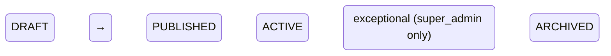

# Program Closure & Archival

## Status
Accepted

## Context

The program lifecycle in Internara currently covers registration through certification.
Once a student receives their certificate, the workflow ends. However, schools have two
post-certification requirements that the system must address:

### 1. Program Closure

When all students in a program have completed their placements, been assessed, and received
certificates, the program must be formally closed. Closure involves:

- Verifying that all required components are complete (assessments finalized, submissions
  graded, attendance verified, supervision logs signed, certificates issued)
- Computing and locking final grade aggregates for each student
- Triggering a Program Quality Evaluation (admin/teacher assessment of the program's
  outcomes)
- Marking the program status from `COMPLETED` to `ARCHIVED`

### 2. School Archives

Indonesian educational regulations require schools to retain student records, grade reports,
and program documentation for a minimum of 5 years after program completion. This means:

- Data cannot be deleted after the program ends
- Data must be preserved in its final, immutable state (grades cannot change after archival)
- Archived programs must remain accessible for read-only viewing by administrators
- Graduated students (alumni) may need access to their certificates

### Existing State

The codebase already has some related infrastructure:

| Component | Location | Status |
|---|---|---|
| `CheckCloseReadinessAction` | Internship domain | ✅ Exists — checks assessments, submissions, logs, attendance |
| `ArchiveStudentAccountsAction` | Admin domain | ✅ Exists — bulk archives student accounts (status → ARCHIVED) |
| `AccountStatus::ARCHIVED` | Auth enum | ✅ Exists — account lifecycle includes archived state |
| `InternshipStatus::COMPLETED` | Internship enum | ✅ Exists — but no transition to ARCHIVED |
| Program Quality Evaluation | Evaluation domain | ⚠️ Defined in key-features but not yet implemented as trigger |

What does NOT exist:

- A `CloseProgramProcess` that coordinates the full closure workflow
- A data snapshot mechanism for immutable archives
- Read-only "archived program" view in the UI
- `InternshipStatus::ARCHIVED` lifecycle state
- Cohort-based alumni marking (triggered by program closure, not individual account actions)

Two approaches were considered:

1. **Soft close** — Mark the program as COMPLETED, leave all records mutable, rely on
   policy to prevent edits. Simpler implementation but no data integrity guarantees.
   Risk: a mistake years later could modify archived grades.

2. **Hard archive** — Create an immutable snapshot of all program records at closure time.
   Source records remain in the database but are locked behind an `ARCHIVED` status gate.
   Snapshot ensures point-in-time integrity for regulatory compliance.

## Decision

### Approach 2 selected — Hard archive with immutable snapshot

Program closure is a multi-step process coordinated by a Process Action:

```
CloseProgramProcess
  │
  ├─ 1. CheckCloseReadinessAction
  │      Verify: all assessments finalized, all submissions graded,
  │      all attendance verified, all certificates issued
  │
  ├─ 2. Trigger Program Quality Evaluation (Evaluation domain)
  │      Admin/teacher must submit evaluation before closure proceeds
  │
  ├─ 3. FinalizeAssessmentsAction
  │      Compute final weighted grade for each student
  │      Freeze all assessment scores (immutable after this point)
  │
  ├─ 4. IssueCertificatesAction (if not already issued)
  │      Batch-issue remaining certificates
  │
  ├─ 5. ArchiveProgramAction
  │      Create immutable data snapshot of all program records
  │      Lock registrations, attendance, logbooks, assignments, grades
  │      Transition program status: COMPLETED → ARCHIVED
  │
  ├─ 6. ArchiveStudentAccountsAction
  │      Mark all active students in the program as alumni
  │      AccountStatus → ARCHIVED (read-only dashboard, certificate access only)
  │
  └─ 7. GenerateArchiveReportAction
        Generate summary document for school records
        (grade summaries, attendance records, completion status)
```

### Data Snapshot

The archive snapshot captures the following data at the moment of closure:

- Student roster with personal data frozen at closure time
- Final grade composites (attendance %, average scores, final score)
- Attendance summary (total days, present, late, absent)
- Logbook submission statistics
- Assignment scores for each submission
- Assessment rubric scores
- Evaluation results
- Certificate serial numbers

The snapshot is stored as a JSON document in an `archives` table (or equivalent),
versioned with a schema version number for forward compatibility.

### Archived Program Lifecycle



- `COMPLETED` → `ARCHIVED`: Normal flow after closure process succeeds
- `ARCHIVED` → `COMPLETED`: Exceptional — only super_admin can un-archive, requires
  audit trail entry recording the reason. Used for data correction in rare cases.
- `ARCHIVED` is a terminal state — no further transitions are allowed
- Archived programs are read-only everywhere: UI hides edit/delete buttons, API rejects
  write requests, policies return false for mutation gates

### Alumni Accounts

Students in an archived program have their accounts transitioned to `AccountStatus::ARCHIVED`.
Archived accounts:
- Can log in with a read-only dashboard (view certificates, view past grades)
- Cannot register for new programs
- Cannot submit new logbooks, assignments, or clock attendance
- Show a banner: "You are an alumnus. Some features are no longer available."

### Retention

Archived program data is retained indefinitely. The application does not provide automatic
deletion of archival records. Schools that need to delete records after regulatory retention
expiry must do so via database-level operations (documented but not automated).

## Consequences

- **Positive**: Regulatory compliance — immutable archive preserves student records, grades,
  and program documentation at the moment of closure. Audit trail confirms exactly what data
  was captured and when.
- **Positive**: Data integrity — no accidental modification of archived records. The
  `ARCHIVED` status gate prevents writes at the model, policy, and UI level.
- **Positive**: Alumni accounts remain accessible — graduates can return to download
  certificates and view their past records.
- **Positive**: Un-archive is possible in exceptional circumstances — controlled by
  super_admin authorization with full audit trail.
- **Negative**: Data snapshot duplicates data that already exists in the operational tables.
  At school scale (thousands of students), this storage cost is negligible.
- **Negative**: Un-archive is complex — reversing the snapshot requires careful handling
  of related records. Only super_admin can perform this operation.
- **Negative**: Program closure is a one-way process for most users — accidental closure
  requires super_admin intervention to reverse.
- **Negative**: The `ARCHIVED` status on student accounts prevents re-registration even for
  different programs. Schools that allow alumni to re-enroll must keep accounts in a
  different status.

## References

- `app/Domain/Internship/Actions/CheckCloseReadinessAction.php` — readiness verification
- `app/Domain/Admin/Actions/ArchiveStudentAccountsAction.php` — student archive
- `app/Domain/Auth/Enums/AccountStatus.php` — ARCHIVED status
- `app/Domain/Internship/Enums/InternshipStatus.php` — program lifecycle enum
- `docs/key-features.md` — Program Closure & Archival section
- `docs/architecture.md` — Action Triad (Process Actions)
