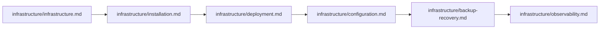

# Documentation Index

> **Last updated:** 2026-06-10
>
> Complete catalog of all documentation in the `docs/` directory. This index is the single entry point for navigating Internara's documentation. Every file listed here is part of the authoritative system documentation and must be kept in sync with the implementation.

---

## Product & Vision

| Document                                               | Description                                                                                                             |
| ------------------------------------------------------ | ----------------------------------------------------------------------------------------------------------------------- |
| [Product Definition](foundation/product-definition.md) | Core product scope, design principles, user personas, system boundary, deployment model, localization, and licensing    |
| [Project Requirements](foundation/project-requirements.md) | Functional and non-functional requirements for Indonesian SMA/SMK PKL management, scalability targets, and compliance   |
| [Key Features](key-features.md)                        | Complete feature inventory across all 19 modules, organized by program lifecycle from foundation through program closure |
| [Project Philosophy](philosophy.md)                    | Guiding principles, values, and vision that shape the project — beyond architecture and code                            |
| [Action-based MVC Architecture](architecture.md)       | 12-layer architecture, Action Triad (Command/Read/Process), cross-module communication, exception hierarchy, validation |
| [Modular Pattern Reference](architecture/modular-pattern.md) | Comprehensive catalog of all design patterns, conventions, workflow patterns, and architectural rules                   |
| [Testing Pattern Reference](architecture/testing-pattern.md) | Comprehensive catalog of all testing patterns, conventions, and practices                                               |
| [Coding Conventions](conventions.md)                   | Mandatory base classes, file structure conventions, PHP rules, naming, policy/enum conventions, testing standards       |

---

## Setup & Operation

| Document                                                         | Description                                                                                            |
| ---------------------------------------------------------------- | ------------------------------------------------------------------------------------------------------ |
| [Getting Started](getting-started.md)                            | End-to-end walkthrough from cloning the repository to completing the setup wizard                      |
| [Installation](infrastructure/installation.md)                   | Deployment reference: prerequisites, VPS/Docker/shared hosting, PHP-FPM, Supervisor, database config   |
| [Deployment](infrastructure/deployment.md)                       | Three deployment paths (VPS, Docker, shared hosting), production checklist, background processes       |
| [Configuration](infrastructure/configuration.md)                 | Three-tier configuration system, environment variables, dev vs production, security, localization      |
| [Post-Setup](foundation/post-setup.md)                                      | First actions as administrator: foundation setup, people management, program configuration, go-live    |
| [Setup Wizard](foundation/setup-wizard.md)                                  | Detailed walkthrough of all 7 setup wizard steps                                                       |
| [Infrastructure Overview](infrastructure/infrastructure.md)      | Deployment options, background process architecture, database and storage considerations               |

---

## Security & Access

| Document                                               | Description                                                                                             |
| ------------------------------------------------------ | ------------------------------------------------------------------------------------------------------- |
| [RBAC](foundation/rbac.md)                                        | Authentication flow, flat role hierarchy, functional roles, permissions model, Gate::before bypass       |
| [Observability](infrastructure/observability.md)       | Monitoring categories, Laravel Pulse integration, SmartLogger dual-channel, health checks               |
| [Account Recovery](foundation/account-recovery.md)                | Recovery slip flow, recovery codes, administrative-mediated recovery, CLI super admin recovery          |

---

## Frontend & UI

| Document                       | Description                                                                          |
| ------------------------------ | ------------------------------------------------------------------------------------ |
| [UI/UX Design](foundation/ui-ux.md)       | Design system (Tailwind CSS v4 + DaisyUI + maryUI), layouts, dark mode, responsive   |
| [Branding](foundation/branding.md)        | Dynamic theming, color system, presets, logo management, font strategy               |

---

## Technical Reference

| Document                                                         | Description                                                                                 |
| ---------------------------------------------------------------- | ------------------------------------------------------------------------------------------- |
| [Database](infrastructure/database.md)                           | Design philosophy, UUID primary keys, SQLite default, engine comparison, index strategy     |
| [Cache](infrastructure/cache.md)                                 | Caching strategy, centralized key registry, invalidation, Redis, OpCache                   |
| [Filesystem](infrastructure/filesystem.md)                       | Storage architecture, Spatie Media Library integration, file locations, image conversions   |
| [Media Library](infrastructure/media-library.md)                 | Collections, conversions, file size limits, queue integration, S3-compatible cloud storage  |
| [Routes](infrastructure/routes.md)                               | Route structure, 18 module-split route files, middleware groups, naming conventions         |
| [Session](infrastructure/session.md)                             | Session configuration, drivers, security considerations                                    |
| [Notifications](infrastructure/notification.md)                  | Multi-channel notification system, CustomDatabaseChannel, mail deliverability, SPF/DKIM    |
| [Queue](infrastructure/queue.md)                                 | Queue drivers, worker management, Supervisor configuration, job lifecycle, retry/backoff   |
| [Testing](infrastructure/testing.md)                             | Testing philosophy, feature vs unit test distinction, LazilyRefreshDatabase, code coverage  |
| [Scaling Guide](infrastructure/scaling.md)                       | Scaling from MVP to 2000+ users, tier transitions, load testing, monitoring thresholds     |
| [Backup & Recovery](infrastructure/backup-recovery.md)           | Backup strategies, database dumps, file backup, restoration, point-in-time recovery         |
| [Localization](infrastructure/localization.md)                   | Supported languages, translation structure, locale resolution, community contribution guide |
| [Known Issues](known-issues.md)                                  | Known limitations, caveats, and workarounds                                                 |

---

## Module Reference

Each module has two documents under `docs/modules/`:

- **Overview** (`docs/modules/{module}.md`) — purpose, boundary, features, design principles
- **Reference** (`docs/modules/{module}-reference.md`) — complete API reference: Actions, Models, Enums, Entities, Policies, Livewire components, Routes, Views, Tests, Factories, Migrations

Internara consists of **19 business modules** plus **1 infrastructure module** (Core), organized by program lifecycle:

| #  | Module            | Overview                             | Reference                                       |
| -- | ----------------- | ------------------------------------ | ----------------------------------------------- |
| 1  | **Core**          | [Overview](modules/core.md)          | [Reference](modules/core-reference.md)          |
| 2  | **Auth**          | [Overview](modules/auth.md)          | [Reference](modules/auth-reference.md)          |
| 3  | **User**          | [Overview](modules/user.md)          | [Reference](modules/user-reference.md)          |
| 4  | **SysAdmin**      | [Overview](modules/sysadmin.md)      | [Reference](modules/sysadmin-reference.md)      |
| 5  | **Setup**         | [Overview](modules/setup.md)         | [Reference](modules/setup-reference.md)         |
| 6  | **Settings**      | [Overview](modules/settings.md)      | [Reference](modules/settings-reference.md)      |
| 7  | **Academics**     | [Overview](modules/academics.md)     | [Reference](modules/academics-reference.md)     |
| 8  | **Program**       | [Overview](modules/program.md)       | [Reference](modules/program-reference.md)       |
| 9  | **Enrollment**    | [Overview](modules/enrollment.md)    | [Reference](modules/enrollment-reference.md)    |
| 10 | **Assessment**    | [Overview](modules/assessment.md)    | [Reference](modules/assessment-reference.md)    |
| 11 | **Evaluation**    | [Overview](modules/evaluation.md)    | [Reference](modules/evaluation-reference.md)    |
| 12 | **Assignment**    | [Overview](modules/assignment.md)    | [Reference](modules/assignment-reference.md)    |
| 13 | **Journals**      | [Overview](modules/journals.md)      | [Reference](modules/journals-reference.md)      |
| 14 | **Guidance**      | [Overview](modules/guidance.md)      | [Reference](modules/guidance-reference.md)      |
| 15 | **Incident**      | [Overview](modules/incident.md)      | [Reference](modules/incident-reference.md)      |
| 16 | **Partners**      | [Overview](modules/partners.md)      | [Reference](modules/partners-reference.md)      |
| 17 | **Certification** | [Overview](modules/certification.md) | [Reference](modules/certification-reference.md) |
| 18 | **Reports**       | [Overview](modules/reports.md)       | [Reference](modules/reports-reference.md)       |
| 19 | **Document**      | [Overview](modules/document.md)      | [Reference](modules/document-reference.md)      |

---

## Architecture Decision Records (ADR)

### Foundation Decisions

| Record                                                                              | Decision                                                                   |
| ----------------------------------------------------------------------------------- | -------------------------------------------------------------------------- |
| [UUID Primary Keys](adr/adr-uuid-primary-keys.md)                                   | UUID v7 primary keys over auto-increment IDs                               |
| [Action-based MVC Architecture](adr/adr-action-based-mvc-architecture.md)           | Module-colocated Action-based MVC over flat layering                       |
| [Action Pattern over Services](adr/adr-action-pattern-over-services.md)             | Single-responsibility Action pattern with Command/Read/Process triad       |
| [Entity-Model Separation](adr/adr-entity-model-separation.md)                       | Business logic entities separated from Eloquent models                     |

### Behavioral Decisions

| Record                                                                  | Decision                                                   |
| ----------------------------------------------------------------------- | ---------------------------------------------------------- |
| [SmartLogger Dual-Channel](adr/adr-smartlogger-dual-channel.md)         | Fluent dual-channel logger with PII masking                |

### Quality Decisions

| Record                                                                                | Decision                                                          |
| ------------------------------------------------------------------------------------- | ----------------------------------------------------------------- |
| [Base Class Mandate](adr/adr-base-class-mandate.md)                                    | Mandatory base classes from the Core module                      |
| [Exception Hierarchy](adr/adr-exception-hierarchy.md)                                  | Dual exception hierarchy (AppException + ModuleException)         |
| [Flat RBAC with Functional Roles](adr/adr-flat-rbac-with-functional-roles.md)          | Flat RBAC with derived functional roles (mentor/mentee)           |
| [Performance Optimization](adr/adr-performance-optimization.md)                        | Three-tier performance strategy with configuration-only upgrades  |

### Governing Decisions

| Record                                                                          | Decision                                                                                    |
| ------------------------------------------------------------------------------- | ------------------------------------------------------------------------------------------- |
| [Self-Hosted Single-Tenant](adr/adr-self-hosted-single-tenant.md)               | Self-hosted, single-tenant deployment model with data sovereignty                           |
| [Cross-Module Communication](adr/adr-cross-module-communication.md)             | Four-pattern communication discipline: direct imports, contracts, events, action delegation |
| [Gradual Migration](adr/adr-gradual-migration.md)                               | Optional complexity with phased migration paths for DTOs, events, and caching               |
| [Program Closure & Archival](adr/adr-program-closure-archival.md)               | Hard archive with immutable data snapshot after program closure                             |

---

## Suggested Reading Order

### For New Developers

```mermaid
flowchart LR
    A[product-definition.md] --> B[key-features.md]
    B --> C[philosophy.md]
    C --> D[getting-started.md]
    D --> E[architecture.md]
    E --> F[architecture/modular-pattern.md]
    F --> G[conventions.md]
    G --> H[modules/{module}.md]
    H --> I[modules/{module}-reference.md]
```

### For Operations / DevOps



### By Role

| Role         | Start Here                                             |
| ------------ | ------------------------------------------------------ |
| Developer    | `architecture.md` → `conventions.md` → `{module}.md`  |
| DevOps       | `infrastructure/infrastructure.md` → `deployment.md`  |
| Product      | `product-definition.md` → `philosophy.md` → `key-features.md` |
| QA/Tester    | `infrastructure/testing.md` → `architecture/testing-pattern.md` → `{module}-reference.md` |
| New Hire     | `getting-started.md` → `architecture.md` → lab module |
