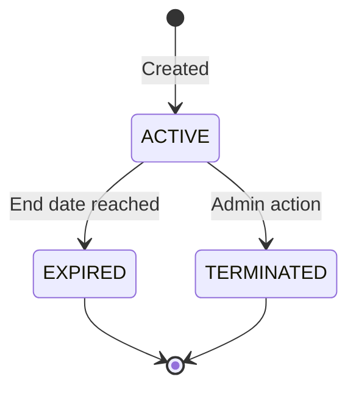

# Chapter 13: Supervisor & Partnership Management

> **Last updated:** 2026-06-16 **Changes:** sync — initial metadata sync with new format

## Description

This chapter covers managing **supervisor accounts** (field mentors) who guide students at partner
companies, and the **company and partnership records** that define external placement relationships.

---

## 13.1 Supervisor Management

Supervisors are company-based mentors who guide students during their fieldwork. Unlike teachers,
supervisors are assigned to a company and oversee placement slots.

### 13.1.1 Creating a Supervisor

1. Go to **Admin → Supervisor Manager** or navigate to `/sysadmin/supervisors`
2. Click **New Supervisor**
3. Fill in the required fields:

| Field       | Description                  | Example                |
| ----------- | ---------------------------- | ---------------------- |
| **Name**    | Full name                    | Budi Santoso           |
| **Email**   | Login email (must be unique) | budi@techcompany.co.id |
| **Phone**   | Contact number               | 0812-3456-7890         |
| **Company** | The company they represent   | PT Teknologi Maju      |

4. Click **Save**

### 13.1.2 Account Slip & Activation

After saving, Internara generates an **account slip** containing the supervisor's initial
credentials:

| Item                 | Description                                    |
| -------------------- | ---------------------------------------------- |
| **Email**            | The email address used during creation         |
| **Initial Password** | A one-time use password for first login        |
| **Account Status**   | Set to PROVISIONED — requires activation       |
| **Activation Code**  | A 16–19 character code for the activation step |

#### Downloading the Account Slip

- **Single account:** After creating a supervisor, a download button appears. Click it to save the
  account slip as a PDF.
- **Bulk download:** Select multiple supervisors from the list and choose **Download Account Slips**
  from the bulk actions menu to print all their credentials at once.

Share the slip with the supervisor through a secure channel — it contains their initial login
credentials.

#### Activating the Account

Supervisors receive their account in a **PROVISIONED** state. Before they can log in, they must:

1. **Option A — Via activation link:** Check email for an activation link sent to the address on
   file. Click the link and follow the prompts.
2. **Option B — Via activation page:** Visit `/activate` on your Internara installation, enter their
   email and the activation code from the slip.
3. **Set a password:** Choose a personal password (minimum 8 characters).
4. **Login:** After activation, log in at `/login` with the registered email and new password.

> The activation process is the same for all user roles. See
> [Chapter 7: Login & Dashboard](07-login-and-dashboard.md#74-account-activation-first-time-users)
> for more details.

Once activated, the supervisor's status changes from PROVISIONED to ACTIVE, and they can access
their dashboard.

### 13.1.3 Editing a Supervisor

1. Find the supervisor in the list
2. Click the **Edit** button
3. Update the fields
4. Click **Save**

### 13.1.4 Deleting a Supervisor

Supervisors can be deleted only if they have no active mentoring assignments. Active supervisors
with current students must be reassigned before deletion.

**Bulk operations:** Select multiple supervisors to delete or export them at once.

---

## 13.2 Company Management

Companies are the external organizations where students complete their fieldwork. Each company can
host multiple internships across different partnership agreements.

Navigate to **Admin → Companies** or go directly to `/admin/companies`.

### 13.2.1 Adding a Company

1. Click **Add Company**
2. Fill in the fields:

| Field               | Description             | Example                                |
| ------------------- | ----------------------- | -------------------------------------- |
| **Name**            | Legal company name      | PT Teknologi Maju                      |
| **Industry Sector** | Industry classification | Technology                             |
| **Address**         | Full street address     | Jl. Sudirman No. 10, Jakarta           |
| **Phone**           | Company phone number    | 021-1234567                            |
| **Email**           | Company contact email   | info@teknologimaju.co.id               |
| **Website**         | Company website URL     | https://teknologimaju.co.id            |
| **Description**     | Optional notes          | Software development and IT consulting |

3. Click **Save**

### 13.2.2 Editing a Company

1. Find the company in the table
2. Click the **Edit** button
3. Update the fields
4. Click **Save**

### 13.2.3 Deleting a Company

A company can be deleted only if it has **no active placements or partnerships**. If the company
still has existing relationships, you must resolve them first:

- Terminate or wait for partnerships to expire
- Reassign or close active placements

**Bulk operations:** Select multiple companies for batch deletion. Companies that are still
referenced by placements or partnerships are automatically skipped — the system shows a summary of
how many were deleted and how many were blocked.

### 13.2.4 Import & Export

The Company Manager supports CSV operations:

| Action                | Description                                                                                               |
| --------------------- | --------------------------------------------------------------------------------------------------------- |
| **Import**            | Upload a CSV file to create multiple companies at once. Existing companies (matched by name) are skipped. |
| **Export**            | Download all visible companies as a CSV file                                                              |
| **Export Selected**   | Download only the selected companies as a CSV file                                                        |
| **Download Template** | Get a blank CSV template with the correct column format                                                   |

**CSV column order:** `Name`, `Address`, `Phone`, `Email`, `Website`, `Description`,
`Industry Sector`

---

## 13.3 Partnership Management

Partnerships represent formal agreements (MoU) between the school and a company. Each partnership
defines the terms, duration, and scope of cooperation. Only active partnerships allow new student
placements.

Navigate to **Admin → Partnerships** or go directly to `/admin/companies/partnerships`.

### 13.3.1 Adding a Partnership

1. Click **Add Partnership**
2. Fill in the fields:

| Field                   | Description                                 | Example                                 |
| ----------------------- | ------------------------------------------- | --------------------------------------- |
| **Company**             | Select the partner company                  | PT Teknologi Maju                       |
| **Agreement Number**    | Unique reference number                     | MOU-001/2026                            |
| **Title**               | Agreement title                             | Software Engineering Internship Program |
| **Start Date**          | Agreement effective date                    | 14 July 2025                            |
| **End Date**            | Agreement expiration date                   | 26 June 2026                            |
| **Scope**               | Description of cooperation scope            | Web development projects, QA testing    |
| **Contact Person**      | Company liaison name                        | Budi Santoso                            |
| **Contact Phone**       | Liaison phone number                        | 0812-3456-7890                          |
| **Contact Email**       | Liaison email                               | budi@teknologimaju.co.id                |
| **Signed By (School)**  | School representative name                  | Drs. Ahmad Fauzi                        |
| **Signed By (Company)** | Company representative name                 | Rina Wijaya, HRD Manager                |
| **Signed At**           | Signing date                                | 10 July 2025                            |
| **Notes**               | Internal notes                              | Extended from previous agreement        |
| **MoU Document**        | Upload the signed agreement (PDF, JPG, PNG) | mou-001-2026.pdf                        |

3. Click **Save**

### 13.3.2 Editing a Partnership

1. Find the partnership in the table
2. Click the **Edit** button
3. Update the fields — note that changing dates may affect active placements
4. Click **Save**

### 13.3.3 Partnership Lifecycle

Partnerships follow a controlled lifecycle:

| Status         | Meaning                        | Placements Allowed?             |
| -------------- | ------------------------------ | ------------------------------- |
| **ACTIVE**     | Agreement is current and valid | Yes                             |
| **EXPIRED**    | End date has passed            | No (existing placements remain) |
| **TERMINATED** | Ended early by admin           | No (existing placements remain) |

**Transition rules:**

- **ACTIVE → EXPIRED** — happens automatically when the end date passes
- **ACTIVE → TERMINATED** — requires admin confirmation
- **EXPIRED** and **TERMINATED** are terminal states — they cannot transition back to active
- Both terminal states preserve the partnership record for historical audit

### 13.3.4 Terminating a Partnership

1. Find the active partnership in the table
2. Click the **Terminate** button (icon: X-circle)
3. Confirm the action in the dialog

Existing placements under this partnership remain unaffected — only new placements are blocked.

### 13.3.5 Renewing a Partnership

When a partnership expires, you can create a renewal:

1. The expired partnership stays on record for historical purposes
2. Create a **new** partnership under the same company with updated dates and agreement number
3. The new partnership starts as ACTIVE

### 13.3.6 Deleting a Partnership

Only **expired** or **terminated** partnerships can be deleted. Active partnerships must be
terminated or expired first before deletion.

**Bulk operations:** Select multiple partnerships to delete at once. Active partnerships are
automatically skipped.

---

## 13.4 Supervisor–Company Assignment

A supervisor must be assigned to a company during account creation. This assignment determines:

- Which placements they can oversee
- Which students they can evaluate
- What data appears on their dashboard

To reassign a supervisor to a different company, edit their profile and change the Company field.

---

## 13.5 Troubleshooting

### Cannot delete a company

The system blocks deletion if the company has:

- Active placements (students currently assigned)
- Active or expired partnerships

Resolve the blocking relationships first, then delete the company.

### Cannot delete a partnership

Active partnerships cannot be deleted. Either:

- Wait for the end date to pass (automatic expiry)
- Terminate the partnership first

### Supervisor not appearing in dropdowns

Ensure the supervisor's company has an active partnership. Supervisors can only be assigned to
placement slots under their company's active partnership agreements.

### CSV import reports invalid rows

Check that:

- The file is in CSV format with UTF-8 encoding
- Column headers match the template order exactly
- Required fields (Name) are not empty
- The file size does not exceed 2 MB

---

**← Previous: [Chapter 12: User Management](12-user-management.md)** **Next:
[Chapter 14: Internship Management & Handbook](14-internship-management-and-handbook.md)**
