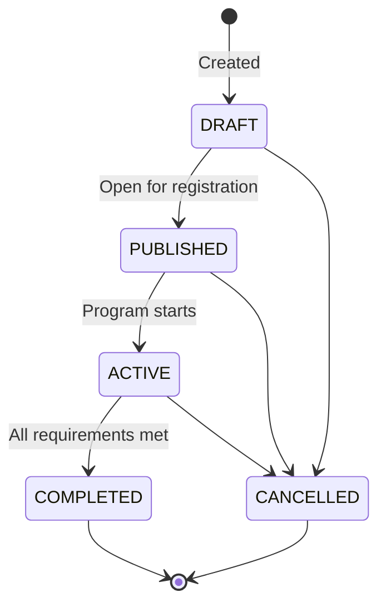

# Chapter 14: Internship Management & Handbook

> **Last updated:** 2026-06-16

This chapter covers how to create and manage internship programs (lowongan PKL), organize students
into groups, and publish handbooks for students to read and acknowledge.

---

## 14.1 Internship Programs

Internship programs define the structure and timeline of a practicum batch. Each program specifies
dates, phases, grading weights, and required documents.

Navigate to **Internship → Programs** or go directly to `/admin/internships`.

### 14.1.1 Creating a Program

1. Click **Add Program**
2. Fill in the fields:

| Field | Description | Example |
|-------|-------------|---------|
| **Name** | Program/batch name | PKL 2025/2026 — Software Engineering |
| **Academic Year** | The school year this program belongs to | 2025/2026 |
| **Start Date** | First day of the internship period | 14 July 2025 |
| **End Date** | Last day of the internship period | 26 June 2026 |
| **Description** | Optional program description | |
| **Registration Start** | When student registration opens (optional) | 1 June 2025 |
| **Registration End** | When student registration closes (optional) | 10 July 2025 |

3. Click **Save**

### 14.1.2 Program Status Lifecycle

Programs follow a controlled lifecycle:

| Status | Meaning | Registrations Allowed? |
|--------|---------|----------------------|
| **Draft** | Being set up, not visible to students | No |
| **Published** | Open for student registration | Yes |
| **Active** | Program is running | No (existing registrations proceed) |
| **Completed** | All students finished, grades finalized | No |
| **Cancelled** | Program cancelled | No |

### 14.1.3 Editing a Program

1. Find the program in the table
2. Click the **Edit** button
3. Update the fields — changing dates may affect existing enrollments
4. Click **Save**

Status transitions are validated — you cannot move from Draft directly to Completed, for example.
The system shows an error if an invalid transition is attempted.

### 14.1.4 Deleting a Program

A program can be deleted only if it has **no placements or registrations**. If students are already
enrolled or slots have been allocated, the deletion is blocked. Archive the program (set to
Completed or Cancelled) instead.

### 14.1.5 Bulk Operations

Select multiple programs to perform bulk actions:

- **Close (Complete) Selected** — marks all filtered programs as Completed
- **Delete Selected** — removes programs without registrations

### 14.1.6 Pre-Close Readiness Check

Before closing a program, use the **Check Readiness** button to verify:

- All assessments are finalized
- All submissions are graded
- All supervision logs are verified
- All attendance records are verified
- All certificates are issued

The readiness check returns a detailed report showing exactly what's blocking closure, so you can
resolve issues before attempting the transition.

---

## 14.2 Internship Groups

Groups (cohorts) organize students placed at the same company slot, with assigned teachers and
supervisors.

Navigate to **Internship → Groups** or go directly to `/admin/internships/groups`.

### 14.2.1 Creating a Group

1. Click **Add Group**
2. Fill in the fields:

| Field | Description | Example |
|-------|-------------|---------|
| **Name** | Group name | Group A — PT Teknologi Maju |
| **Internship** | The program this group belongs to | PKL 2025/2026 |
| **Placement** | The company slot assigned to this group | PT Teknologi Maju (3 slots) |
| **Description** | Optional notes | |

3. Click **Save**

### 14.2.2 Managing Members

1. Open a group and click **Manage Members**
2. Add members by selecting their role:

| Role | Description |
|------|-------------|
| **Student** | A registered student placed in this group |
| **School Teacher** | The teacher supervising this group |
| **Industry Supervisor** | The company mentor for this group |

3. Click **Add** to confirm

### 14.2.3 Removing Members

Click the remove button next to any member to remove them from the group. This does not delete their
registration — only their group assignment.

### 14.2.4 Deleting a Group

A group can be deleted only if it has no members. Remove all members first, then delete the group.

---

## 14.3 Handbooks

Handbooks are policy documents (PDF) that administrators upload for students, teachers, and
supervisors to read and acknowledge. They are managed under the Guidance module.

### 14.3.1 Admin: Managing Handbooks

Navigate to **System → Handbooks** or go directly to `/admin/handbooks`.

#### Creating a Handbook

1. Click **New Handbook**
2. Fill in the fields:

| Field | Description | Example |
|-------|-------------|---------|
| **Title** | Handbook title | PKL Code of Conduct 2025/2026 |
| **Target Audience** | Who should see this handbook | All Roles / Students / Teachers / Supervisors |
| **Description** | Short summary of the handbook | |
| **PDF File** | Upload the handbook document (PDF, max 10 MB) | |
| **Active** | Toggle visibility on/off | On |

3. Click **Save**

#### Editing a Handbook

1. Find the handbook in the table
2. Click **Edit** — you can change the title, audience, description, or upload a new PDF
3. If you upload a new PDF, the **version number** increments automatically
4. Toggle **Active** to show or hide the handbook from users

#### Deleting a Handbook

Click **Delete** to remove a handbook. This hides it from all users.

### 14.3.2 Student: Viewing and Acknowledging Handbooks

Navigate to **Student Portal → Handbooks** from the sidebar.

Each handbook card shows:
- **Title** and description
- **Version number**
- **Status** — Acknowledged or needs acknowledgment
- **Download** button to save the PDF

#### Acknowledging a Handbook

1. Open a handbook you haven't acknowledged yet
2. Click **Mark as Read**
3. The system records your acknowledgment (user, timestamp, IP address)

Once acknowledged, the badge changes to "Acknowledged" and you won't be asked to acknowledge that
version again. If the admin uploads a new version, you'll need to acknowledge it again.

#### Downloading a Handbook

Click **Download** to save the handbook PDF to your device. You can download handbooks without
acknowledging them first.

### 14.3.3 Role-Targeted Visibility

Handbooks are shown based on your role:

| Your Role | Handbooks You See |
|-----------|-------------------|
| Student | Handbooks targeted at Students or All Roles |
| Teacher | Handbooks targeted at Teachers or All Roles |
| Supervisor | Handbooks targeted at Supervisors or All Roles |

---

## 14.4 Troubleshooting

### Cannot delete a program

The system blocks deletion if the program has:
- Active placements (company slots allocated)
- Student registrations

Either cancel the program instead, or remove all placements and registrations first.

### Cannot close a program

Run the **Check Readiness** tool to see exactly what's blocking closure. Common blockers:
- Assessments not finalized
- Submissions not graded
- Supervision logs unverified
- Certificates not issued

### Student cannot see a handbook

Check that:
- The handbook is set to **Active**
- The handbook's **Target Audience** includes the student's role
- The handbook has an uploaded PDF file

### Handbook version shows as "unacknowledged" after reading

If the admin uploaded a new version, the system requires re-acknowledgment. Open the handbook and
click **Mark as Read** again.

---

**← Previous: [Chapter 13: Supervisor & Partnership Management](13-supervisor-and-partnership.md)**
**Next: [Chapter 15: Internship Registration & Placement](15-internship-registration-and-placement.md)**
