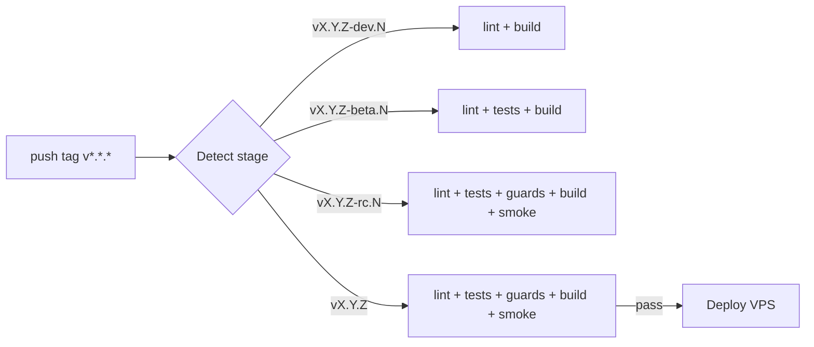

# CI/CD — Release Pipeline, Automation & Quality Gates

## Description

Continuous Integration and Deployment configuration for Internara, built around a single
tag-driven release pipeline (`.github/workflows/release.yml`) with four promotion stages and
reusable gate scripts under `.github/scripts/`.

---

## Pipeline Overview

The whole pipeline is triggered by pushing a SemVer tag (`v*.*.*`) to GitHub. The stage is derived
from the tag suffix, and only the final production stage deploys to the VPS.



### Stage mapping

| Pushed tag               | Stage        | Jobs run on GitHub Actions                                    |
| ------------------------ | ------------ | ------------------------------------------------------------ |
| `vX.Y.Z-dev.<N>`         | Development  | `lint.sh` (Pint + PHPStan) + frontend build                   |
| `vX.Y.Z-beta.<N>`        | Testing/QA   | + `test.sh` (Pest, coverage gate)                            |
| `vX.Y.Z-rc.<N>`          | Staging/RC   | + `guards.sh` (arch + security + conventions) + `smoke.sh`   |
| `vX.Y.Z` (final)         | Production   | all of the above, then the VPS deploy job                     |

Releases are promoted upward: `development → testing → staging → production`. Every QA stage runs in
GitHub Actions (free, no VPS load). A final tag never reaches the VPS unless every QA tier passes.

---

## Reusable gate scripts (`.github/scripts/`)

| Script      | What it runs                                            | Fail-fast order |
| ----------- | ------------------------------------------------------- | --------------- |
| `lint.sh`   | `vendor/bin/pint --test` + `vendor/bin/phpstan analyse --no-progress` | 1 (cheapest) |
| `test.sh`   | `vendor/bin/pest --coverage --min=<MIN_COVERAGE>` (default 80) | 2 |
| `guards.sh` | `scan_violations` / `scan_security` / `scan_conventions` (all `--strict`) | 3 |
| `smoke.sh`  | migrate + `route:list` on a clean SQLite DB (boot sanity) | 4 |
| `deploy.sh` | VPS-side: compose up + prune + health check (production only) | — |

---

## GitHub Actions workflow (`.github/workflows/release.yml`)

Single workflow, five jobs:

1. **`stage`** — derives stage & version from the pushed tag (regex on the suffix: `dev`/`beta`/`rc`
   → pre-release; no suffix → production).
2. **`dev`** — runs only when stage == `dev`: `lint.sh` + `npm run build`.
3. **`testing`** — stage == `testing`: `lint.sh` + `test.sh` + build + `composer audit`.
4. **`staging`** — stage == `staging`: `lint.sh` + `test.sh` + `guards.sh` + build + `smoke.sh` +
   `composer audit`.
5. **`production`** — stage == `production`: all QA gates (same as staging).
6. **`deploy`** — `needs: [stage, production]`, runs only when production QA succeeded: SSHs to the
   VPS (`VPS_HOST`/`VPS_USER`/`VPS_SSH_KEY`), `git checkout $VERSION_TAG` +
   `git reset --hard $VERSION_TAG`, then `VERSION_TAG=$VERSION_TAG bash .github/scripts/deploy.sh`.

Environment: PHP 8.4, SQLite in-memory for tests, `concurrency` grouped by tag to avoid parallel
runs for a re-pushed tag.

---

## Local Quality Commands

Same gates as CI, run locally:

```bash
vendor/bin/pint --test                      # PHP code style
vendor/bin/phpstan analyse --no-progress    # PHPStan level 8 (static analysis)
vendor/bin/pest --coverage --min=80         # full test suite + coverage gate
python3 tools/scan_violations.py --strict   # C1-C8 / D1-D6 invariants
python3 tools/scan_security.py --strict     # security anti-patterns
python3 tools/scan_conventions.py --strict  # conventions
npm run build                               # Vite production build
```

---

## Release workflow

See [Deployment](deployment.md) for the full VPS/CI/CD operational details and
`.agents/context/deploy-topology.md` for operational caveats (agent context).

### How to release (staged)

1. Bump `composer.json` `version` to `X.Y.Z` (and sync `package.json`, `README.md`,
   `docs/project-vision.md`, `docs/guides/upgrading.md`).
2. Push the final tag (or pre-release tags to run QA tiers first):
   ```bash
   git tag vX.Y.Z && git push origin vX.Y.Z
   # optional staged rollout:
   git tag vX.Y.Z-rc.1 && git push origin vX.Y.Z-rc.1
   ```
3. The pipeline runs QA; on a final tag, the deploy job ships `vX.Y.Z` to the VPS (`$HOME/apps/internara`).

### Secrets

Deploy secrets (`VPS_HOST`, `VPS_USER`, `VPS_SSH_KEY`) live in GitHub Actions secrets, never in the
repo. `deploy.sh` requires no credentials — the SSH key authenticates on the runner.

---

## Monitoring CI Health

- **Health Gate**: `deploy.sh` waits for `HEALTH_URL` (`https://internara.web.id`, product demo) to
  return 200 within 60s, else dumps `docker compose ps`.
- **Coverage**: measured per run via `--coverage --min`; no external coverage service required.
- **Diagnostics**: failed deploys surface in the runner logs (`deploy ok:` / health-check failures).

---

## References

- `.github/workflows/release.yml` — the pipeline definition
- `.github/scripts/*.sh` — reusable gates & deploy script
- [Deployment](deployment.md) — environment setup, Docker stack, reverse proxy
- [Infrastructure](infrastructure.md) — tier-based infra design
- [Testing](testing.md) — test strategy & quality gates
