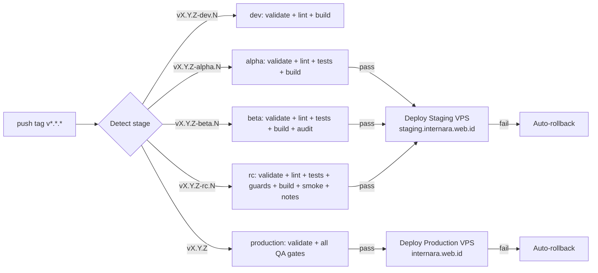

# CI/CD — Release Pipeline, Automation & Quality Gates

## Description

Continuous Integration and Deployment configuration for Internara, built around a single
tag-driven release pipeline (`.github/workflows/release.yml`) with four promotion stages,
reusable gate scripts under `.github/scripts/`, and comprehensive deployment safety mechanisms
including automatic rollback and release notes generation.

---


## Prerequisites

See [Installation](../installation.md#prerequisites) for full server requirements and verification commands.

## Steps

This document is reference-oriented. For installation and setup procedures, see:

1. [Installation](../installation.md) — server preparation and CLI provisioning
2. [Setup Wizard](../setup-wizard.md) — browser-based initial configuration
3. [Post-Setup](../post-setup.md) — initial data population after wizard completion

## Pipeline Overview

The whole pipeline is triggered by pushing a SemVer tag (`v*.*.*`) to GitHub. The stage is derived
from the tag suffix, following a three-tier promotion lifecycle: `dev` (development) > `pre-release`
(`alpha`, `beta`, `rc`, deployed to staging VPS `staging.internara.web.id`) > `release` (production,
deployed to `internara.web.id`).



### Stage mapping

| Pushed tag | Stage | Jobs run on GitHub Actions | Deploy Target |
| ------------------------ | ------------ | ------------------------------------------------------------ | --------------------------------------------- |
| `vX.Y.Z-dev.<N>` | Development (`dev`) | `validate` + `lint.sh` (Pint) + frontend build | None (CI only) |
| `vX.Y.Z-alpha.<N>` | Pre-release (`alpha`) | + `test.sh` (Pest) + frontend build | Staging VPS (`staging.internara.web.id`) |
| `vX.Y.Z-beta.<N>` | Pre-release (`beta`) | + `test.sh` (Pest, coverage gate) + `composer audit` | Staging VPS (`staging.internara.web.id`) |
| `vX.Y.Z-rc.<N>` | Pre-release (`staging`) | + `guards.sh` (arch + security + conventions) + `smoke.sh` + release notes | Staging VPS (`staging.internara.web.id`) |
| `vX.Y.Z` (final) | Release (`production`) | all of the above + release notes artifact | Production VPS (`internara.web.id`) |

Releases are promoted upward: `development → pre-release (alpha/beta/rc) → release (production)`. Every QA stage runs in
GitHub Actions (free, no VPS load). Pre-release stages deploy to `https://staging.internara.web.id` using Docker Compose,
and a final tag deploys to production only when all production QA gates pass.

### Hotfix branch — automated fast-track deploy

For critical fixes that must reach production immediately, pushing to the **`hotfix` branch** triggers
an automated fast-track workflow (`.github/workflows/hotfix.yaml`). It runs PHP syntax validation, Pint,
Prettier, and deploys directly to the production VPS with the standard health check and auto-rollback.
Once deployment succeeds, it automatically merges `hotfix` into `staging` to prevent branch drift.

| Aspect | Tag-driven release | `hotfix` branch |
| --------------------- | ----------------------------- | ---------------------------------- |
| Trigger | Push `v*.*.*` tag | Push to `hotfix` branch |
| QA | Full staged gates on CI | Fail-fast syntax + lint + format |
| Deploy | Via `deploy` job in `release.yml` | Via `deploy` job in `hotfix.yaml` |
| Version bump required | Yes | No |
| Rollback | Automatic-on-failure | Automatic-on-failure |
| Staging sync | On next merge/tag | Automatic (`sync-staging` job) |
| Use for | Features, releases | Emergency production patches |

The automated flow:

```bash
# 1. Commit fix and push to hotfix (also keep main in sync)
git checkout hotfix && git merge main
git push origin hotfix

# 2. GitHub Actions (.github/workflows/hotfix.yaml) executes automatically:
#    - Job 'lint': validates syntax and code formatting
#    - Job 'deploy': SSH deploys hotfix with HEALTH_URL check and auto-rollback
#    - Job 'sync-staging': automatically merges hotfix into staging and pushes
```

Because `deploy.sh` builds from `GIT_URL=...#hotfix` and gates on the 60s `HEALTH_URL` check, a
successful run guarantees the live site is serving the `hotfix` branch. Local quality gates still
apply — run `vendor/bin/pint --test`, targeted Pest tests, and arch scanners before
pushing. See [Deployment](deployment.md#hotfix-branch--automated-fast-track-deploy) for the
full procedure.

---

## Reusable gate scripts (`.github/scripts/`)

| Script | What it runs | Fail-fast order |
| ------------------- | ------------------------------------------------------- | --------------- |
| `lint.sh` | `vendor/bin/pint --test` | 1 (cheapest) |
| `test.sh` | `vendor/bin/pest --coverage --min=<MIN_COVERAGE>` (default 80) | 2 |
| `guards.sh` | `scan_violations` / `scan_security` / `scan_conventions` (all `--strict`) | 3 |
| `smoke.sh` | migrate + `route:list` on a clean SQLite DB (boot sanity) | 4 |
| `release-notes.sh` | Extract changelog from CHANGELOG.md or generate from git log | — |
| `deploy.sh` | VPS-side: compose up + prune + health check + auto-rollback | — |
| `backup.sh` | VPS-side: create backup metadata before deploy | — |
| `rollback.sh` | VPS-side: restore previous version and redeploy | — |

---

## GitHub Actions workflow (`.github/workflows/release.yml`)

Single workflow, nine jobs:

1. **`stage`** — derives stage & version from the pushed tag (regex on the suffix: `dev` → dev;
   `alpha`/`beta`/`rc` → pre-release; no suffix → production).
2. **`validate`** — ensures `composer.json` version matches the tag, validates PHP syntax,
   `composer.json` schema, and runs npm audit. Runs for all stages (fail-fast).
3. **`dev`** — runs only when stage == `dev`: `lint.sh` + `npm run build` (with dependency caching).
4. **`alpha`** — stage == `alpha`: `lint.sh` + `test.sh` + `npm run build`.
5. **`beta`** — stage == `beta`: `lint.sh` + `test.sh` (with coverage) + build + `composer audit`.
6. **`staging`** — stage == `staging` (for `-rc.*` tags): `lint.sh` + `test.sh` + `guards.sh` + build +
   `smoke.sh` + `composer audit` + release notes generation.
7. **`production`** — stage == `production`: all QA gates (same as staging) + release notes artifact upload.
8. **`deploy-prerelease`** — `needs: [stage, validate, alpha, beta, staging]`, runs when any pre-release QA stage
   succeeds: SSHs to staging VPS (`staging.internara.web.id`), creates a backup, checkouts the tag, runs
   `HEALTH_URL="https://staging.internara.web.id" deploy.sh` with Docker Compose. Includes automatic rollback on failure.
9. **`deploy`** — `needs: [stage, validate, production]`, runs only when production QA succeeded: SSHs to
   the production VPS (`VPS_HOST`/`VPS_USER`/`VPS_SSH_KEY`), creates a backup, `git checkout $VERSION_TAG` +
   `git reset --hard $VERSION_TAG`, then `HEALTH_URL="https://internara.web.id" VERSION_TAG=$VERSION_TAG bash .github/scripts/deploy.sh`.
   Includes automatic rollback on failure.

Environment: PHP 8.4, SQLite in-memory for tests, `concurrency` grouped by tag to avoid parallel
runs for a re-pushed tag. Dependency caching enabled for both Composer and npm.

---

## Deployment Safety

### Automatic Rollback

The deploy process includes automatic rollback on failure:

1. **Before deploy**: `backup.sh` stores the current git revision and timestamp
2. **During deploy**: `deploy.sh` builds and starts containers, then waits for health check
3. **On failure**: If health check fails, `deploy.sh` automatically rolls back to the previous revision
4. **Manual rollback**: Run `ssh user@vps 'cd $HOME/apps/internara && bash .github/scripts/rollback.sh'`

### Backup Retention

- Backups are stored in `$HOME/apps/internara/.backups/`
- Only the last 5 backups are retained (disk space management)
- Each backup contains: timestamp, git revision, tag, creation date

---

## Local Quality Commands

Same gates as CI, run locally:

```bash
vendor/bin/pint --test                      # PHP code style
vendor/bin/pest --coverage --min=80         # full test suite + coverage gate
python3 tools/scan_violations.py --strict   # C1-C8 / D1-D6 invariants
python3 tools/scan_security.py --strict     # security anti-patterns
python3 tools/scan_conventions.py --strict  # conventions
npm run build                               # Vite production build

```

---

## Release workflow

See [Deployment](deployment.md) for the full VPS/CI/CD operational details.

### How to release (staged)

1. Bump `composer.json` `version` to `X.Y.Z` (and sync `package.json`, `README.md` badge,
   `docs/project-vision.md`, `docs/guides/upgrading.md`).
2. Update `CHANGELOG.md` with the new version section.
3. Push the final tag (or pre-release tags to run QA tiers first):

   ```bash
   git tag vX.Y.Z && git push origin vX.Y.Z
   # optional staged rollout:
   git tag vX.Y.Z-rc.1 && git push origin vX.Y.Z-rc.1
   ```

4. The pipeline runs QA; on a final tag, the deploy job ships `vX.Y.Z` to the VPS (`$HOME/apps/internara`).
5. Release notes are automatically generated and uploaded as artifacts.

### Secrets

Deploy secrets (`VPS_HOST`, `VPS_USER`, `VPS_SSH_KEY`) live in GitHub Actions secrets, never in the
repo. `deploy.sh` requires no credentials — the SSH key authenticates on the runner.

---

## Monitoring CI Health

- **Health Gate**: `deploy.sh` waits for `HEALTH_URL` (`https://internara.web.id`, product demo) to
  return 200 within 60s, else triggers automatic rollback.
- **Coverage**: measured per run via `--coverage --min`; no external coverage service required.
- **Diagnostics**: failed deploys surface in the runner logs with rollback instructions.
- **Artifacts**: Release notes are uploaded as build artifacts (retained for 90 days).

---

## References

- `.github/workflows/release.yml` — the pipeline definition
- `.github/scripts/*.sh` — reusable gates, deploy, backup, rollback & release notes scripts
- [Deployment](deployment.md) — environment setup, Docker stack, reverse proxy
- [Infrastructure](infrastructure.md) — tier-based infra design
- [Testing](testing.md) — test strategy & quality gates
---

## Troubleshooting

| Symptom | Cause | Fix |
|---------|-------|-----|
