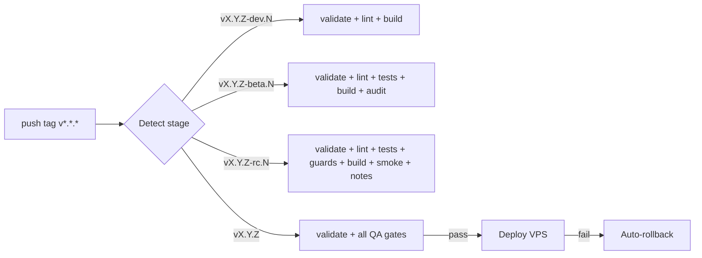

# CI/CD — Release Pipeline, Automation & Quality Gates

## Description

Continuous Integration and Deployment configuration for Internara, built around a single
tag-driven release pipeline (`.github/workflows/release.yml`) with four promotion stages,
reusable gate scripts under `.github/scripts/`, and comprehensive deployment safety mechanisms
including automatic rollback and release notes generation.

---

## Pipeline Overview

The whole pipeline is triggered by pushing a SemVer tag (`v*.*.*`) to GitHub. The stage is derived
from the tag suffix, and only the final production stage deploys to the VPS.



### Stage mapping

| Pushed tag               | Stage        | Jobs run on GitHub Actions                                    |
| ------------------------ | ------------ | ------------------------------------------------------------ |
| `vX.Y.Z-dev.<N>`         | Development  | `validate` + `lint.sh` (Pint) + frontend build               |
| `vX.Y.Z-beta.<N>`        | Testing/QA   | + `test.sh` (Pest, coverage gate) + `composer audit`         |
| `vX.Y.Z-rc.<N>`          | Staging/RC   | + `guards.sh` (arch + security + conventions) + `smoke.sh` + release notes |
| `vX.Y.Z` (final)         | Production   | all of the above, then the VPS deploy job with rollback      |

Releases are promoted upward: `development → testing → staging → production`. Every QA stage runs in
GitHub Actions (free, no VPS load). A final tag never reaches the VPS unless every QA tier passes.

---

## Reusable gate scripts (`.github/scripts/`)

| Script              | What it runs                                            | Fail-fast order |
| ------------------- | ------------------------------------------------------- | --------------- |
| `lint.sh`           | `vendor/bin/pint --test`                                | 1 (cheapest)    |
| `test.sh`           | `vendor/bin/pest --coverage --min=<MIN_COVERAGE>` (default 80) | 2              |
| `guards.sh`         | `scan_violations` / `scan_security` / `scan_conventions` (all `--strict`) | 3 |
| `smoke.sh`          | migrate + `route:list` on a clean SQLite DB (boot sanity) | 4              |
| `release-notes.sh`  | Extract changelog from CHANGELOG.md or generate from git log | —         |
| `deploy.sh`         | VPS-side: compose up + prune + health check + auto-rollback | —          |
| `backup.sh`         | VPS-side: create backup metadata before deploy          | —               |
| `rollback.sh`       | VPS-side: restore previous version and redeploy         | —               |

---

## GitHub Actions workflow (`.github/workflows/release.yml`)

Single workflow, seven jobs:

1. **`stage`** — derives stage & version from the pushed tag (regex on the suffix: `dev`/`beta`/`rc`
   → pre-release; no suffix → production).
2. **`validate`** — ensures `composer.json` version matches the tag, validates PHP syntax,
   `composer.json` schema, and runs npm audit. Runs for all stages (fail-fast).
3. **`dev`** — runs only when stage == `dev`: `lint.sh` + `npm run build` (with dependency caching).
4. **`testing`** — stage == `testing`: `lint.sh` + `test.sh` + build + `composer audit` (with caching).
5. **`staging`** — stage == `staging`: `lint.sh` + `test.sh` + `guards.sh` + build + `smoke.sh` +
   `composer audit` + release notes generation.
6. **`production`** — stage == `production`: all QA gates (same as staging) + release notes artifact upload.
7. **`deploy`** — `needs: [stage, validate, production]`, runs only when production QA succeeded: SSHs to
   the VPS (`VPS_HOST`/`VPS_USER`/`VPS_SSH_KEY`), creates a backup, `git checkout $VERSION_TAG` +
   `git reset --hard $VERSION_TAG`, then `VERSION_TAG=$VERSION_TAG bash .github/scripts/deploy.sh`.
   Includes automatic rollback on failure.

Environment: PHP 8.4, SQLite in-memory for tests, `concurrency` grouped by tag to avoid parallel
runs for a re-pushed tag. Dependency caching enabled for both Composer and npm.

---

## Deployment Safety

### Automatic Rollback

The deploy process includes automatic rollback on failure:

1. **Before deploy**: `backup.sh` stores the current git revision and timestamp
2. **During deploy**: `deploy.sh` builds and starts containers, then waits for health check
3. **On failure**: If health check fails, `deploy.sh` automatically rolls back to the previous revision
4. **Manual rollback**: Run `ssh user@vps 'cd $HOME/apps/internara && bash .github/scripts/rollback.sh'`

### Backup Retention

- Backups are stored in `$HOME/apps/internara/.backups/`
- Only the last 5 backups are retained (disk space management)
- Each backup contains: timestamp, git revision, tag, creation date

---

## Local Quality Commands

Same gates as CI, run locally:

```bash
vendor/bin/pint --test                      # PHP code style
vendor/bin/pest --coverage --min=80         # full test suite + coverage gate
python3 tools/scan_violations.py --strict   # C1-C8 / D1-D6 invariants
python3 tools/scan_security.py --strict     # security anti-patterns
python3 tools/scan_conventions.py --strict  # conventions
npm run build                               # Vite production build
```

---

## Release workflow

See [Deployment](deployment.md) for the full VPS/CI/CD operational details and
`.agents/context/deploy-topology.md` for operational caveats (agent context).

### How to release (staged)

1. Bump `composer.json` `version` to `X.Y.Z` (and sync `package.json`, `README.md` badge,
   `docs/project-vision.md`, `docs/guides/upgrading.md`).
2. Update `CHANGELOG.md` with the new version section.
3. Push the final tag (or pre-release tags to run QA tiers first):
   ```bash
   git tag vX.Y.Z && git push origin vX.Y.Z
   # optional staged rollout:
   git tag vX.Y.Z-rc.1 && git push origin vX.Y.Z-rc.1
   ```
4. The pipeline runs QA; on a final tag, the deploy job ships `vX.Y.Z` to the VPS (`$HOME/apps/internara`).
5. Release notes are automatically generated and uploaded as artifacts.

### Secrets

Deploy secrets (`VPS_HOST`, `VPS_USER`, `VPS_SSH_KEY`) live in GitHub Actions secrets, never in the
repo. `deploy.sh` requires no credentials — the SSH key authenticates on the runner.

---

## Monitoring CI Health

- **Health Gate**: `deploy.sh` waits for `HEALTH_URL` (`https://internara.web.id`, product demo) to
  return 200 within 60s, else triggers automatic rollback.
- **Coverage**: measured per run via `--coverage --min`; no external coverage service required.
- **Diagnostics**: failed deploys surface in the runner logs with rollback instructions.
- **Artifacts**: Release notes are uploaded as build artifacts (retained for 90 days).

---

## References

- `.github/workflows/release.yml` — the pipeline definition
- `.github/scripts/*.sh` — reusable gates, deploy, backup, rollback & release notes scripts
- [Deployment](deployment.md) — environment setup, Docker stack, reverse proxy
- [Infrastructure](infrastructure.md) — tier-based infra design
- [Testing](testing.md) — test strategy & quality gates
