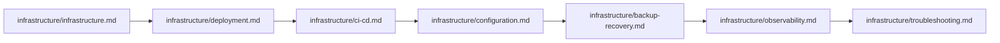

# Documentation Index — Complete Catalog of docs/

> **Last updated:** 2026-07-10 **Changes:** expand — add API, CI/CD, troubleshooting, changelog; reorganize sections; add suggested reading paths

Complete catalog of all documentation files, organized by topic and audience.

---

## Quick Links

| Resource | Audience |
| -------- | -------- |
| **[CONTRIBUTING.md](../CONTRIBUTING.md)** | Developers (root-level contribution guide) |
| **[SECURITY.md](../SECURITY.md)** | Security researchers (vulnerability reporting) |
| **[CHANGELOG.md](../CHANGELOG.md)** | All (release history) |
| **[README.md](../README.md)** | All (project overview) |

---

## Product & Vision

- **[Foundation Index](foundation/index.md)** — Browse all foundation documents
- **[Product Definition](foundation/product-definition.md)** — Core product scope, design principles, user personas, system boundary
- **[Project Requirements](foundation/project-requirements.md)** — Functional, non-functional, and UI/UX requirements
- **[Key Features](key-features.md)** — Complete 150+ feature inventory across all 19 modules
- **[Project Philosophy](philosophy.md)** — Guiding principles, values, and vision
- **[Architecture](architecture.md)** — 4-layer architecture, data flow, Action Triad, dependency rules
- **[Entity Relationship Diagram](foundation/erd.md)** — Full ERD schema (55 tables)
- **[Coding Conventions](conventions.md)** — PHP rules, naming, security, testing standards (+ ToC)

---

## Setup & Operation

- **[Getting Started](getting-started.md)** — End-to-end walkthrough from cloning to completing the setup wizard
- **[Infrastructure Overview](infrastructure/infrastructure.md)** — Deployment options, 3-tier architecture, background processes
- **[Deployment](infrastructure/deployment.md)** — Three deployment paths (shared hosting, VPS, Docker), production checklist
- **[Configuration](infrastructure/configuration.md)** — Three-tier configuration system, environment variables, dev vs production
- **[CI/CD Pipeline](infrastructure/ci-cd.md)** — GitHub Actions workflow, quality gates, artifact management
- **[Troubleshooting](infrastructure/troubleshooting.md)** — Common issues, diagnostics, resolutions for all subsystems

---

## User Manual

- **[User Manual (22 chapters)](guide/index.md)** — Installation, setup wizard, daily operations, health, upgrades
- Chapter 1: [Installation](guide/01-installation.md)
- Chapter 2: [Setup Wizard](guide/02-setup-wizard.md)
- Chapter 3: [Post-Setup](guide/03-post-setup.md)
- Chapter 4: [System Health & Troubleshooting](guide/04-system-health-and-troubleshooting.md)
- Chapter 5: [Upgrading](guide/05-upgrading-from-previous.md)
- Chapter 6: [Admin Create & Recovery](guide/06-admin-create-and-recovery.md)
- Chapter 7: [Login & Dashboard](guide/07-login-and-dashboard.md)
- Chapter 9: [User Profile & Recovery](guide/09-user-profile-and-recovery.md)
- Chapter 10: [System Settings & Backups](guide/10-system-settings-and-backups.md)
- Chapter 11: [Institution & Academics](guide/11-institution-and-academics.md)
- Chapter 12: [User Management](guide/12-user-management.md)
- Chapter 13: [Supervisor & Partnership](guide/13-supervisor-and-partnership.md)
- Chapter 14: [Internship & Handbook](guide/14-internship-management-and-handbook.md)
- Chapter 15: [Registration & Placement](guide/15-internship-registration-and-placement.md)
- Chapter 16: [Attendance & Logbook](guide/16-attendance-and-logbook.md)
- Chapter 17: [Monitoring & Supervision](guide/17-monitoring-visit-and-supervision-log.md)
- Chapter 18: [Assignment & Assessment](guide/18-assignment-and-assessment.md)
- Chapter 19: [Report & Certification](guide/19-student-report-and-certification.md)
- Chapter 20: [Evaluation & Incident](guide/20-evaluation-and-incident.md)
- Chapter 21: [Announcement & Notifications](guide/21-announcement-and-notifications.md)
- Chapter 22: [System Observability](guide/22-system-observability.md)

---

## Security & Access

- **[SECURITY.md](../SECURITY.md)** — Vulnerability reporting policy (repo root)
- **[RBAC](foundation/rbac.md)** — Authentication flow, flat role hierarchy, functional roles, permissions model
- **[Observability](infrastructure/observability.md)** — Monitoring, Laravel Pulse, SmartLogger, health checks
- **[Account Recovery](foundation/account-recovery.md)** — Recovery slip flow, recovery codes, CLI super admin recovery

---

## Frontend & UI

- **[UI/UX Design](foundation/ui-ux.md)** — Design system (Tailwind CSS v4 + DaisyUI + maryUI), layouts, dark mode
- **[Branding](foundation/branding.md)** — Dynamic theming, color system, presets, logo management

---

## Pattern References

- **[Pattern Index](architecture/index.md)** — Browse all 16 architecture design patterns
- **[Action Triad](architecture/action-pattern.md)** — Command/Read/Process action patterns
- **[Entity-Model Separation](architecture/entity-pattern.md)** — Entity bridge pattern, immutability
- **[Model (Active Record)](architecture/model-pattern.md)** — Eloquent model patterns, UUID PKs
- **[Data Transfer Objects](architecture/data-pattern.md)** — BaseData DTO patterns, ActionResponse
- **[Events & Notifications](architecture/event-pattern.md)** — BaseEvent, dispatch patterns, listeners
- **[Enum & State Machine](architecture/enum-pattern.md)** — LabelEnum, StatusEnum, state machines
- **[Livewire Components](architecture/livewire-pattern.md)** — Thin component rule, Form Objects, BaseRecordManager
- **[Exception Hierarchy](architecture/exception-pattern.md)** — Dual AppException/ModuleException trees
- **[Authorization](architecture/policy-pattern.md)** — Flat RBAC, three-layer auth, Gate::before
- **[Logging & PII](architecture/logging-pattern.md)** — SmartLogger, PII masking, translation
- **[Caching](architecture/cache-pattern.md)** — Centralized key registry, TTL categories
- **[Service vs Support vs Action](architecture/service-pattern.md)** — Domain vs infra vs static logic
- **[Repository Pattern](architecture/repository-pattern.md)** — Why no Repository layer
- **[Testing Patterns](architecture/testing-pattern.md)** — Scope isolation, layer strategies

---

## API & Technical Reference

- **[API Reference](api/index.md)** — Complete HTTP endpoint catalog (100+ routes)
- **[Infrastructure Index](infrastructure/index.md)** — Browse all infrastructure and operations docs
- **[Database](infrastructure/database.md)** — Schema design, UUID PKs, engine comparison, index strategy
- **[Cache](infrastructure/cache.md)** — Caching strategy, key registry, invalidation, Redis
- **[Filesystem](infrastructure/filesystem.md)** — Storage architecture, Media Library, image conversions
- **[Media Library](infrastructure/media-library.md)** — Collections, conversions, S3-compatible storage
- **[Routes](infrastructure/routes.md)** — Route structure, 17 module-split files, middleware groups
- **[Session](infrastructure/session.md)** — Configuration, drivers, security
- **[Notifications](infrastructure/notification.md)** — Multi-channel system, mail deliverability
- **[Queue](infrastructure/queue.md)** — Drivers, workers, Supervisor, job lifecycle
- **[Testing Infrastructure](infrastructure/testing.md)** — Testing philosophy, scope isolation
- **[Scaling Guide](infrastructure/scaling.md)** — MVP to 2000+ users, tier transitions
- **[Backup & Recovery](infrastructure/backup-recovery.md)** — Backup strategies, restoration
- **[Localization](infrastructure/localization.md)** — Translations, locale resolution, contributing
- **[Troubleshooting](infrastructure/troubleshooting.md)** — Common issues and resolutions

---

## Modules

Refer to the [Module Documentation Index](modules/index.md) for the complete listing of all 19 business modules plus Core. Each module has two documents:

- **Overview** (`docs/modules/{module}.md`) — purpose, boundary, features, design principles
- **Reference** (`docs/modules/{module}-reference.md`) — complete API reference (Models, Actions, Routes, Policies, Livewire, events)

---

## Architecture Decision Records

Refer to the [ADR Index](adr/index.md) for all 14 records covering foundation, observability, quality, and strategic decisions.

---

## Roadmap & Planning

- **[Roadmap](roadmap.md)** — Feature plans, module maturity, milestone timeline
- **[GitHub Issues](https://github.com/reasvyn/internara/issues)** — Bug tracker, known issues, feature requests
- **[GitHub Discussions](https://github.com/reasvyn/internara/discussions)** — Q&A, ideas, community

---

## Suggested Reading Order

### For New Developers

### For Operations / DevOps

### For Contributors

### By Role

- **Developer** — Start with `contributing.md`, `architecture.md`, then architecture patterns and module index
- **DevOps** — Start with infrastructure overview, deployment, CI/CD, then troubleshooting
- **Product** — Start with product definition, philosophy, key features, and roadmap
- **QA/Tester** — Start with testing guide, testing patterns, and per-module reference docs
- **New Hire** — Start with contributing guide, getting started, architecture overview, conventions, then module index
