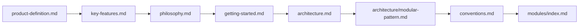
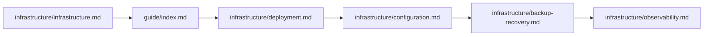

# Documentation Index — Complete Catalog of docs/

Complete catalog of all documentation files, organized by topic and audience.

## Product & Vision

- **[Foundation Index](foundation/index.md)** — Browse all foundation documents
- **[Product Definition](foundation/product-definition.md)** — Core product scope, design
  principles, user personas, system boundary, deployment model, localization, and licensing
- **[Project Requirements](foundation/project-requirements.md)** — Functional and non-functional
  requirements for Indonesian SMA/SMK PKL management, scalability targets, and compliance
- **[Key Features](key-features.md)** — Complete feature inventory across all 19 modules, organized
  by program lifecycle
- **[Project Philosophy](philosophy.md)** — Guiding principles, values, and vision that shape the
  project
- **[Action-based MVC Architecture](architecture.md)** — 4-layer architecture, data flow, domain vs
  infrastructure vs static logic, Action Triad, dependency rules
- **[Modular Pattern Reference](architecture/modular-pattern.md)** — Comprehensive catalog of all
  design patterns, conventions, and architectural rules
- **[Testing Pattern Reference](architecture/testing-pattern.md)** — Comprehensive catalog of all
  testing patterns, conventions, and practices
- **[Coding Conventions](conventions.md)** — Mandatory base classes, file structure conventions, PHP
  rules, naming, security, testing standards
- **[Entity Relationship Diagram](foundation/erd.md)** — Full ERD schema

---

## Setup & Operation

- **[Getting Started](getting-started.md)** — End-to-end walkthrough from cloning to completing the
  setup wizard
- **[Infrastructure Overview](infrastructure/infrastructure.md)** — Deployment options, background
  process architecture, database and storage
- **[Deployment](infrastructure/deployment.md)** — Three deployment paths (VPS, Docker, shared
  hosting), production checklist
- **[Configuration](infrastructure/configuration.md)** — Three-tier configuration system,
  environment variables, dev vs production

---

## User Manual

- **[User Manual (10 chapters)](guide/index.md)** — Step-by-step user guide covering installation,
  wizard, post-setup, login, dashboard, profile, recovery, health, upgrades, admin recovery, system
  settings, institution, academics, and user management

---

## Security & Access

- **[RBAC](foundation/rbac.md)** — Authentication flow, flat role hierarchy, functional roles,
  permissions model, Gate::before bypass
- **[Observability](infrastructure/observability.md)** — Monitoring categories, Laravel Pulse
  integration, SmartLogger dual-channel, health checks
- **[Account Recovery](foundation/account-recovery.md)** — Recovery slip flow, recovery codes,
  administrative-mediated recovery, CLI super admin recovery

---

## Frontend & UI

- **[UI/UX Design](foundation/ui-ux.md)** — Design system (Tailwind CSS v4 + DaisyUI + maryUI),
  layouts, dark mode, responsive
- **[Branding](foundation/branding.md)** — Dynamic theming, color system, presets, logo management,
  font strategy

---

## Pattern References

- **[Pattern Index](architecture/index.md)** — Browse all architecture design patterns
- **[Modular Architecture](architecture/modular-pattern.md)** — Complete catalog of all design
  patterns, conventions, and architectural rules
- **[Action Triad](architecture/action-pattern.md)** — Command/Read/Process action patterns,
  transaction safety, ActionResponse contract
- **[Entity-Model Separation](architecture/entity-pattern.md)** — Entity bridge pattern,
  immutability, fromModel, entity extraction workflow
- **[Model (Active Record)](architecture/model-pattern.md)** — Eloquent model patterns, UUID PKs,
  scopes, relationships, casts, factories
- **[Data Transfer Objects](architecture/data-pattern.md)** — BaseData DTO patterns,
  fromArray/toArray, ActionResponse, DTO migration path
- **[Events & Notifications](architecture/event-pattern.md)** — BaseEvent contract, dispatch
  patterns, listeners, multi-channel notifications
- **[Enum & State Machine](architecture/enum-pattern.md)** — LabelEnum/StatusEnum/ColorableEnum
  contracts, state machine patterns
- **[Livewire Components](architecture/livewire-pattern.md)** — Thin component rule, Form Objects,
  BaseRecordManager, auto-discovery
- **[Exception Hierarchy](architecture/exception-pattern.md)** — Dual AppException/ModuleException
  trees, HasExceptionContext, HandlesActionErrors
- **[Authorization](architecture/policy-pattern.md)** — Flat RBAC, three-layer auth, Gate::before
  bypass, policy inventory
- **[Logging & PII](architecture/logging-pattern.md)** — SmartLogger dual-channel fluent API, PII
  masking, translation resolution
- **[Caching](architecture/cache-pattern.md)** — Centralized key registry, TTL categories,
  event-driven invalidation, driver tiers
- **[Service Layer](architecture/service-pattern.md)** — Services vs Actions vs Support — domain
  logic vs infra logic vs static utilities
- **[Support Utilities](architecture/support-pattern.md)** — Module-level helpers, static-only, no
  constructor injection
- **[Repository](architecture/repository-pattern.md)** — Why no Repository layer, Eloquent as
  Repository, query tier patterns
- **[Testing](architecture/testing-pattern.md)** — All testing patterns, scope isolation, layer
  strategies, assertions, performance

---

## Technical Reference

- **[Infrastructure Index](infrastructure/index.md)** — Browse all infrastructure and operations
  docs
- **[Database](infrastructure/database.md)** — Design philosophy, UUID primary keys, SQLite default,
  engine comparison, index strategy
- **[Cache](infrastructure/cache.md)** — Caching strategy, centralized key registry, invalidation,
  Redis, OpCache
- **[Filesystem](infrastructure/filesystem.md)** — Storage architecture, Spatie Media Library
  integration, file locations, image conversions
- **[Media Library](infrastructure/media-library.md)** — Collections, conversions, file size limits,
  queue integration, S3-compatible cloud storage
- **[Routes](infrastructure/routes.md)** — Route structure, 17 module-split route files, middleware
  groups, naming conventions
- **[Session](infrastructure/session.md)** — Session configuration, drivers, security considerations
- **[Notifications](infrastructure/notification.md)** — Multi-channel notification system,
  CustomDatabaseChannel, mail deliverability, SPF/DKIM
- **[Queue](infrastructure/queue.md)** — Queue drivers, worker management, Supervisor configuration,
  job lifecycle, retry/backoff
- **[Testing](infrastructure/testing.md)** — Testing philosophy, feature vs unit test distinction,
  LazilyRefreshDatabase, code coverage
- **[Scaling Guide](infrastructure/scaling.md)** — Scaling from MVP to 2000+ users, tier
  transitions, load testing, monitoring thresholds
- **[Backup & Recovery](infrastructure/backup-recovery.md)** — Backup strategies, database dumps,
  file backup, restoration, point-in-time recovery
- **[Localization](infrastructure/localization.md)** — Supported languages, translation structure,
  locale resolution, community contribution guide
- **[GitHub Issues](https://github.com/reasvyn/internara/issues)** — Bug tracker, known issues, and
  feature requests
- **[Roadmap](roadmap.md)** — Feature plans and implementation roadmap

---

## Modules

Refer to the [Module Documentation Index](modules/index.md) for the complete listing of all 19
business modules plus Core. Each module has two documents:

- **Overview** (`docs/modules/{module}.md`) — purpose, boundary, features, design principles
- **Reference** (`docs/modules/{module}-reference.md`) — complete API reference

---

## Architecture Decision Records

Refer to the [ADR Index](adr/index.md) for the complete listing of all 14 records covering
foundation, observability, quality, and strategic decisions.

---

## Suggested Reading Order

### For New Developers

### For Operations / DevOps

### By Role

- **Developer** — Start with `architecture.md`, then read architecture patterns, conventions, and
  the module index
- **DevOps** — Start with infrastructure overview, then deployment and configuration docs
- **Product** — Start with product definition, philosophy, and key features catalog
- **QA/Tester** — Start with testing guide, testing patterns, and module index
- **New Hire** — Start with getting started guide, architecture overview, and module index
