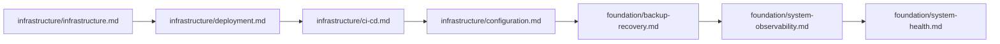

# Documentation Index — Complete Catalog of docs/

> **Last updated:** 2026-07-22 **Changes:** feat — split enrollment, internships, system-settings specs

Complete catalog of all documentation files, organized by topic and audience.

---

## Quick Links

| Resource | Audience |
| -------- | -------- |
| **[CONTRIBUTING.md](../CONTRIBUTING.md)** | Developers (root-level contribution guide) |
| **[SECURITY.md](../SECURITY.md)** | Security researchers (vulnerability reporting) |
| **[README.md](../README.md)** | All (project overview) |

---

## Product & Vision

- **[Foundation Index](foundation/index.md)** — Browse all foundation documents
- **[Product Definition](foundation/product-definition.md)** — Core product scope, design principles, user personas, system boundary
- **[Project Requirements](foundation/project-requirements.md)** — Functional, non-functional, and UI/UX requirements
- **[Project Philosophy](philosophy.md)** — Guiding principles, values, and vision
- **[Architecture](architecture.md)** — 4-layer architecture, data flow, Action Triad, dependency rules
- **[Schema Design Philosophy](specs/system-requirements.md#73-schema-design-philosophy)** — 37 domain tables, 9 optimization decisions, package/framework tables
- **[Coding Conventions](conventions.md)** — PHP rules, naming, security, testing standards (+ ToC)

---

## Setup & Operation

- **[Getting Started](getting-started.md)** — End-to-end walkthrough from cloning to completing the setup wizard
- **[Infrastructure Overview](infrastructure/infrastructure.md)** — Deployment options, 3-tier architecture, background processes
- **[Deployment](infrastructure/deployment.md)** — Three deployment paths (shared hosting, VPS, Docker), production checklist
- **[Configuration](infrastructure/configuration.md)** — Three-tier configuration system, environment variables, dev vs production
- **[CI/CD Pipeline](infrastructure/ci-cd.md)** — GitHub Actions workflow, quality gates, artifact management
- **[System Health & Troubleshooting](foundation/system-health.md)** — Health checks, common problems, diagnostics

---

## Operational Guides

- [Installation](foundation/installation.md) — Server prep, dependencies, first run
- [Setup Wizard](foundation/setup-wizard.md) — Browser-based initial configuration
- [Post-Setup](foundation/post-setup.md) — First actions after installation
- [System Health & Troubleshooting](foundation/system-health.md) — Health checks, common problems, maintenance
- [Upgrading](foundation/upgrading.md) — Upgrade procedure, rollback, versioning
- [Backup & Recovery](foundation/backup-recovery.md) — Account recovery, system backup, restoration
- [System Observability](foundation/system-observability.md) — Pulse, audit logs, cleanup, backups

---

## Security & Access

- **[SECURITY.md](../SECURITY.md)** — Vulnerability reporting policy (repo root)
- **[RBAC](foundation/rbac.md)** — Authentication flow, flat role hierarchy, functional roles, permissions model
- **[System Observability](foundation/system-observability.md)** — SmartLogger, Pulse, audit logs, compliance
- **[Security](infrastructure/security.md)** — Network hardening, security headers, rate limiting, PII, GDPR, scanning
- **[Account Recovery](foundation/account-recovery.md)** — Recovery slip flow, recovery codes, CLI super admin recovery

---

## Frontend & UI

- **[UI/UX Design](foundation/ui-ux.md)** — Design system (Tailwind CSS v4 + DaisyUI + maryUI), layouts, dark mode
- **[Branding](foundation/branding.md)** — Dynamic theming, color system, presets, logo management

---

## Pattern References

- **[Pattern Index](architecture/index.md)** — Browse all 16 architecture design patterns
- **[Action Triad](architecture/action-pattern.md)** — Command/Read/Process action patterns
- **[Entity-Model Separation](architecture/entity-pattern.md)** — Entity bridge pattern, immutability
- **[Model (Active Record)](architecture/model-pattern.md)** — Eloquent model patterns, UUID PKs
- **[Data Transfer Objects](architecture/data-pattern.md)** — BaseData DTO patterns, ActionResponse
- **[Events & Notifications](architecture/event-pattern.md)** — BaseEvent, dispatch patterns, listeners
- **[Enum & State Machine](architecture/enum-pattern.md)** — LabelEnum, StatusEnum, state machines
- **[Livewire Components](architecture/livewire-pattern.md)** — Thin component rule, Form Objects, BaseRecordManager
- **[Exception Hierarchy](architecture/exception-pattern.md)** — Dual AppException/ModuleException trees
- **[Authorization](architecture/policy-pattern.md)** — Flat RBAC, three-layer auth, Gate::before
- **[Logging & PII](architecture/logging-pattern.md)** — SmartLogger, PII masking, translation
- **[Caching](architecture/cache-pattern.md)** — Centralized key registry, TTL categories
- **[Service vs Support vs Action](architecture/service-pattern.md)** — Domain vs infra vs static logic
- **[Repository Pattern](architecture/repository-pattern.md)** — Why no Repository layer
- **[Testing Patterns](architecture/testing-pattern.md)** — Scope isolation, layer strategies

---

## Technical Reference

- **[Infrastructure Index](infrastructure/index.md)** — Browse all infrastructure and operations docs
- **[Database](infrastructure/database.md)** — Schema design, UUID PKs, engine comparison, index strategy
- **[Cache](infrastructure/cache.md)** — Caching strategy, key registry, invalidation, Redis
- **[Filesystem](infrastructure/filesystem.md)** — Storage architecture, Media Library, image conversions
- **[Media Library](infrastructure/media-library.md)** — Collections, conversions, S3-compatible storage
- **[Routes](infrastructure/routes.md)** — Route structure, 17 module-split files, middleware groups
- **[Session](infrastructure/session.md)** — Configuration, drivers, security
- **[Notifications](infrastructure/notification.md)** — Multi-channel system, mail deliverability
- **[Queue](infrastructure/queue.md)** — Drivers, workers, Supervisor, job lifecycle
- **[Testing Infrastructure](infrastructure/testing.md)** — Testing philosophy, scope isolation
- **[Scaling Guide](infrastructure/scaling.md)** — MVP to 2000+ users, tier transitions
- **[Localization](infrastructure/localization.md)** — Translations, locale resolution, contributing
- **[Developer Tools](infrastructure/tools.md)** — Python scan scripts, CLI flags, output schema

---

## Modules

Refer to the [Module Documentation Index](modules/index.md) for the complete listing of all 22 modules. Each module has two documents:

- **Overview** (`docs/modules/{module}.md`) — purpose, boundary, features, design principles
- **Reference** (`docs/modules/{module}-reference.md`) — complete API reference (Models, Actions, Routes, Policies, Livewire, events)

---

## Architecture Decision Records

Refer to the [ADR Index](adr/index.md) for all 14 records covering foundation, observability, quality, and strategic decisions.

---

## Feature Specifications

- **[Specs Index](specs/index.md)** — All feature specification documents

---

## Roadmap & Planning

- **[Roadmap](roadmap.md)** — Feature plans, module maturity, milestone timeline
- **[GitHub Issues](https://github.com/reasvyn/internara/issues)** — Bug tracker, known issues, feature requests
- **[GitHub Discussions](https://github.com/reasvyn/internara/discussions)** — Q&A, ideas, community

---

## Suggested Reading Order

### For New Developers

### For Operations / DevOps

### For Contributors

### By Role

- **Developer** — Start with `contributing.md`, `architecture.md`, then architecture patterns and module index
- **DevOps** — Start with infrastructure overview, deployment, CI/CD, then troubleshooting
- **Product** — Start with product definition, philosophy, key features, and roadmap
- **QA/Tester** — Start with testing guide, testing patterns, and per-module reference docs
- **New Hire** — Start with contributing guide, getting started, architecture overview, conventions, then module index
