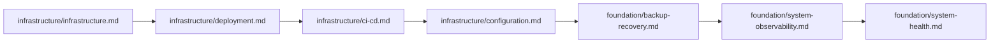
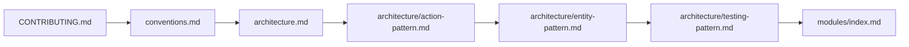

# Documentation Index — Complete Catalog of docs/

> **Last updated:** 2026-08-25 **Changes:** feat — refs/deps and adr gained index/template docs; every docs subdir now has its own index.md

Complete catalog of all documentation files, organized by topic and audience.

---

## Quick Links

| Resource | Audience |
| -------- | -------- |
| **[CONTRIBUTING.md](../CONTRIBUTING.md)** | Developers (root-level contribution guide) |
| **[CODE_OF_CONDUCT.md](../CODE_OF_CONDUCT.md)** | All community participants (Contributor Covenant v2.1) |
| **[SECURITY.md](../SECURITY.md)** | Security researchers (vulnerability reporting) |
| **[README.md](../README.md)** | All (project overview) |

---

## Product & Vision

- **[Foundation Index](guides/index.md)** — Browse all foundation documents
- **[README](../README.md)** — Project overview: pitch, features, requirements, installation, deployment, status (deep product definition in `project-vision.md`)
- **[Internara Project Spec](specs/QLHDO-internara-project.md)** — Functional, non-functional, and UI/UX requirements
- **[Project Philosophy](philosophy.md)** — Guiding principles, values, and vision
- **[Project Vision](project-vision.md)** — 3–5 year direction, strategic pillars, success metrics, boundaries, decision compass
- **[Architecture](architecture.md)** — 4-layer architecture, data flow, Action Triad, dependency rules
- **[Schema Design Philosophy](specs/J68GZ-system-requirements.md#73-schema-design-philosophy)** — 37 domain tables, 9 optimization decisions, package/framework tables
- **[Coding Conventions](conventions.md)** — PHP rules, naming, security, testing standards (+ ToC)
- **[Documentation Standards](doc-template.md)** — Diátaxis four-quadrant model mapped to this repo, writing principles, metadata contract; copy-paste skeletons live per directory (`specs/spec-template.md`, `modules/*-template.md`, `architecture/pattern-template.md`, `foundation/guide-template.md`)

---

## Setup & Operation

- **[Getting Started](getting-started.md)** — End-to-end walkthrough from cloning to completing the setup wizard
- **[Infrastructure Overview](guides/infra/infrastructure.md)** — Deployment options, 3-tier architecture, background processes
- **[Deployment](guides/infra/deployment.md)** — Three deployment paths (shared hosting, VPS, Docker), production checklist
- **[Configuration](guides/infra/configuration.md)** — Three-tier configuration system, environment variables, dev vs production
- **[CI/CD Pipeline](guides/infra/ci-cd.md)** — GitHub Actions workflow, quality gates, artifact management
- **[System Health & Troubleshooting](guides/system-health.md)** — Health checks, common problems, diagnostics
- **[Project Contexts](../.agents/context/index.md)** — Intentional design constraints, deploy caveats, dependency pins, and codebase intentional states (agent-oriented)

---

## Operational Guides

- [Installation](guides/installation.md) — Server prep, dependencies, first run
- [Setup Wizard](guides/setup-wizard.md) — Browser-based initial configuration
- [Post-Setup](guides/post-setup.md) — First actions after installation
- [System Health & Troubleshooting](guides/system-health.md) — Health checks, common problems, maintenance
- [Upgrading](guides/upgrading.md) — Upgrade procedure, rollback, versioning
- [Backup & Recovery](guides/backup-recovery.md) — Account recovery, system backup, restoration
- [System Observability](guides/system-observability.md) — Pulse, audit logs, cleanup, backups

---

## Security & Access

- **[SECURITY.md](../SECURITY.md)** — Vulnerability reporting policy (repo root)
- **[RBAC](guides/rbac.md)** — Authentication flow, flat role hierarchy, functional roles, permissions model
- **[System Observability](guides/system-observability.md)** — SmartLogger, Pulse, audit logs, compliance
- **[Security](guides/infra/security.md)** — Network hardening, security headers, rate limiting, PII, GDPR, scanning
- **[Account Recovery](guides/account-recovery.md)** — Recovery slip flow, recovery codes, CLI super admin recovery

---

## Frontend & UI

- **[UI/UX Design](guides/ui-ux.md)** — Design system (Tailwind CSS v4 + TallstackUI v4 + self-hosted palette), layouts, dark mode
- **[Branding](guides/branding.md)** — Dynamic theming, color system, presets, logo management

---

## Pattern References

- **[Pattern Index](guides/arch/index.md)** — Browse all 16 architecture design patterns
- **[Action Triad](guides/arch/action-pattern.md)** — Command/Read/Process action patterns
- **[Entity-Model Separation](guides/arch/entity-pattern.md)** — Entity bridge pattern, immutability
- **[Model (Active Record)](guides/arch/model-pattern.md)** — Eloquent model patterns, UUID PKs
- **[Data Transfer Objects](guides/arch/data-pattern.md)** — BaseData DTO patterns, ActionResponse
- **[Events & Notifications](guides/arch/event-pattern.md)** — BaseEvent, dispatch patterns, listeners
- **[Enum & State Machine](guides/arch/enum-pattern.md)** — LabelEnum, StatusEnum, state machines
- **[Livewire Components](guides/arch/livewire-pattern.md)** — Thin component rule, Form Objects, BaseRecordManager
- **[Exception Hierarchy](guides/arch/exception-pattern.md)** — Dual AppException/ModuleException trees
- **[Authorization](guides/arch/policy-pattern.md)** — Flat RBAC, three-layer auth, Gate::before
- **[Logging & PII](guides/arch/logging-pattern.md)** — SmartLogger, PII masking, translation
- **[Caching](guides/arch/cache-pattern.md)** — Centralized key registry, TTL categories
- **[Service vs Support vs Action](guides/arch/service-pattern.md)** — Domain vs infra vs static logic
- **[Repository Pattern](guides/arch/repository-pattern.md)** — Why no Repository layer
- **[Testing Patterns](guides/arch/testing-pattern.md)** — Scope isolation, layer strategies

---

## Technical Reference

- **[Reference Docs](refs/index.md)** — reference tier catalog: module references (`refs/modules/`) and per-dependency references (`refs/deps/`)
- **[Dependencies](refs/deps/index.md)** — one conceptual reference per runtime dependency (`docs/refs/deps/`): `laravel` · `livewire` · `tallstackui` · `alpinejs` · `tailwindcss` · `vite` · `spatie-laravel-permission` · `spatie-laravel-medialibrary` · `spatie-laravel-activitylog` · `spatie-laravel-model-status` · `laravel-dompdf` · `laravel-pulse` · `laravel-lang` · `flatpickr` · `marked` · `prettier`
- **[Infrastructure Index](guides/infra/index.md)** — Browse all infrastructure and operations docs
- **[Database](guides/infra/database.md)** — Schema design, UUID PKs, engine comparison, index strategy
- **[Cache](guides/infra/cache.md)** — Caching strategy, key registry, invalidation, Redis
- **[Filesystem](guides/infra/filesystem.md)** — Storage architecture, Media Library, image conversions
- **[Media Library](guides/infra/media-library.md)** — Collections, conversions, S3-compatible storage
- **[Routes](guides/infra/routes.md)** — Route structure, 17 module-split files, middleware groups
- **[Session](guides/infra/session.md)** — Configuration, drivers, security
- **[Notifications](guides/infra/notification.md)** — Multi-channel system, mail deliverability
- **[Queue](guides/infra/queue.md)** — Drivers, workers, Supervisor, job lifecycle
- **[Testing Infrastructure](guides/infra/testing.md)** — Testing philosophy, scope isolation
- **[Scaling Guide](guides/infra/scaling.md)** — MVP to 2000+ users, tier transitions
- **[Localization](guides/infra/localization.md)** — Translations, locale resolution, contributing
- **[Developer Tools](guides/infra/tools.md)** — Python scan scripts, CLI flags, output schema

---

## Modules

Refer to the [Module Documentation Index](refs/modules/index.md) for the complete listing of all 18 modules. Each module has two documents:

- **Overview** (`docs/refs/modules/{module}.md`) — purpose, boundary, features, design principles
- **Reference** (`docs/refs/modules/{module}-reference.md`) — complete API reference (Models, Actions, Routes, Policies, Livewire, events)

---

## Architecture Decision Records

Refer to the [ADR Index](adr/index.md) for all 14 records covering foundation, observability, quality, and strategic decisions.

---

## Feature Specifications

- **[Specs Index](specs/index.md)** — All feature specification documents

---

## Roadmap & Planning

- **[GitHub Issues](https://github.com/reasvyn/internara/issues)** — Bug tracker, known issues, feature requests
- **[GitHub Discussions](https://github.com/reasvyn/internara/discussions)** — Q&A, ideas, community

---

## Suggested Reading Order

### For New Developers

```mermaid
flowchart LR
    A[CONTRIBUTING.md] --> B[../README.md]
    B --> C[specs/index.md]
    C --> D[philosophy.md]
    D --> E[getting-started.md]
    E --> F[architecture.md]
    F --> G[conventions.md]
    G --> H[modules/index.md]
```

### For Operations / DevOps

```mermaid
flowchart LR
    A[infrastructure/infrastructure.md] --> B[infrastructure/deployment.md]
    B --> C[infrastructure/ci-cd.md]
    C --> D[infrastructure/configuration.md]
    D --> E[foundation/backup-recovery.md]
    E --> F[foundation/system-observability.md]
    F --> G[foundation/system-health.md]
```

### For Contributors

```mermaid
flowchart LR
    A[CONTRIBUTING.md] --> B[conventions.md]
    B --> C[architecture.md]
    C --> D[architecture/action-pattern.md]
    D --> E[architecture/entity-pattern.md]
    E --> F[architecture/testing-pattern.md]
    F --> G[modules/index.md]
```

### By Role

- **Developer** — Start with `contributing.md`, `architecture.md`, then architecture patterns and module index
- **DevOps** — Start with infrastructure overview, deployment, CI/CD, then troubleshooting
- **Product** — Start with product definition, philosophy, key features
- **QA/Tester** — Start with testing guide, testing patterns, and per-module reference docs
- **New Hire** — Start with contributing guide, getting started, architecture overview, conventions, then module index
