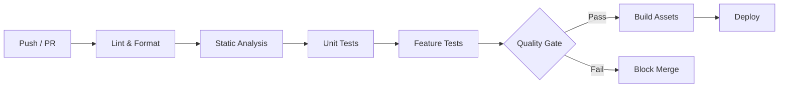

# CI/CD — Pipeline, Automation & Quality Gates

> **Last updated:** 2026-07-10 **Changes:** initial — comprehensive CI/CD pipeline documentation

## Description

Continuous Integration and Deployment pipeline configuration, quality gates, and automation
workflows for Internara.

---

## Pipeline Overview



---

## Quality Gates

Every commit and pull request must pass the following gates before merge:

| Gate | Tool | Threshold | Command |
| ---- | ---- | --------- | ------- |
| Code Style | Laravel Pint | No diffs | `vendor/bin/pint --test` |
| Formatting | Prettier | No diffs | `npm run format:check` |
| Static Analysis | PHPStan (level 8) | No errors | `vendor/bin/phpstan analyse --no-progress` |
| Unit Tests | Pest | 100% pass | `composer run test:unit` |
| Feature Tests | Pest | 100% pass | `composer run test:feature` |
| Frontend Build | Vite | No errors | `npm run build` |
| Coverage | Pest (pcov) | ≥ 85% | `composer run coverage` |

### Fast-Fail Order

Pipelines should execute gates in fast-fail order:

1. **Lint & Format** (cheapest, fastest) — fail immediately on style issues
2. **Static Analysis** — catch type errors and boundary violations
3. **Unit Tests** — fast, no database required
4. **Feature Tests** — slower, database-backed
5. **Coverage** — most expensive, run last

---

## GitHub Actions Workflow

```yaml
name: CI

on:
  push:
    branches: [main, develop]
  pull_request:
    branches: [main]

jobs:
  quality:
    runs-on: ubuntu-latest
    services:
      mysql:
        image: mysql:8
        env:
          MYSQL_ALLOW_EMPTY_PASSWORD: yes
          MYSQL_DATABASE: internara_test
        ports:
          - 3306:3306
        options: --health-cmd="mysqladmin ping" --health-interval=10s --health-timeout=5s --health-retries=3

    steps:
      - uses: actions/checkout@v4

      - name: Setup PHP
        uses: shivammathur/setup-php@v2
        with:
          php-version: '8.4'
          extensions: bcmath, ctype, dom, fileinfo, json, mbstring, openssl, pdo, pdo_mysql, tokenbin, xml, pcov
          coverage: pcov
          tools: composer:v2

      - name: Cache Composer dependencies
        uses: actions/cache@v4
        with:
          path: vendor
          key: composer-${{ hashFiles('composer.lock') }}

      - name: Install PHP dependencies
        run: composer install --no-interaction --prefer-dist

      - name: Setup Node
        uses: actions/setup-node@v4
        with:
          node-version: '22'
          cache: 'npm'

      - name: Install Node dependencies
        run: npm ci

      - name: Lint PHP
        run: vendor/bin/pint --test

      - name: Lint Blade/JS/CSS
        run: npm run lint

      - name: Static Analysis
        run: vendor/bin/phpstan analyse --no-progress

      - name: Build frontend
        run: npm run build

      - name: Run tests
        env:
          DB_CONNECTION: mysql
          DB_HOST: 127.0.0.1
          DB_PORT: 3306
          DB_DATABASE: internara_test
          DB_USERNAME: root
          DB_PASSWORD: ""
        run: php artisan test --compact --coverage --min=85
```

---

## Local Quality Commands

```bash
# Quick check (lint + analyse + feature tests)
composer run quality

# Full check (format + strict analyse + coverage)
composer run quality:full

# Individual gates
composer run lint              # PHP + JS lint
composer run analyse           # PHPStan level 8
composer run test              # Full test suite
composer run test:unit         # Unit tests only
composer run test:feature      # Feature tests only
composer run coverage          # With coverage report
npm run build                  # Vite production build
```

---

## Branch Protection Rules

| Branch | Required Checks | Review Required | Notes |
| ------ | --------------- | --------------- | ----- |
| `main` | All quality gates | 1 approving review | Protected — no direct pushes |
| `develop` | All quality gates | None | Integration branch |

---

## Deployment Pipeline

See [Deployment](deployment.md) for infrastructure setup. The CI pipeline produces a deployable
artifact:

```bash
# Build artifact (runs in CI)
composer install --optimize-autoloader --no-dev --no-interaction
npm ci && npm run build
rm -rf node_modules/ node_modules/.package-lock.json

# Deploy artifact to target environment
# Options: rsync, Docker image push, deployer, etc.
```

### Environment-Specific Steps

| Environment | CI Triggers | Post-Deploy Steps |
| ----------- | ----------- | ----------------- |
| Development | Push to `develop` | `php artisan migrate` |
| Staging | PR to `main` | `php artisan migrate --force` + `php artisan system:health` |
| Production | Merge to `main` | `php artisan migrate --force` + cache warm + health check |

---

## Artifact Requirements

The deployable artifact must include:

- `vendor/` (production dependencies only)
- `public/build/` (compiled Vite assets)
- `public/.htaccess` or Nginx config
- `storage/` directory structure

The following must be excluded:

- `node_modules/`
- `.git/`
- `tests/`
- `docs/`
- Development-only config files

---

## Secrets Management

| Secret | Usage | Environment |
| ------ | ----- | ----------- |
| `APP_KEY` | Laravel encryption key | All environments |
| `DB_*` | Database credentials | Per environment |
| `MAIL_*` | SMTP credentials | Production |
| `CRON_SECRET` | Scheduler webhook auth | Production |
| `APPLE_ID_*` / `GOOGLE_*` | OAuth (future) | Production |

Secrets are stored in GitHub Actions secrets (for CI) and `.env` files (for deployments).

---

## Monitoring CI Health

- **Pulse**: Track queue throughput, slow jobs, and failed jobs
- **Health Check**: `php artisan system:health` runs in CI post-deploy
- **Notifications**: CI failures sent to project maintainer email
- **Coverage Report**: Generated as CI artifact, published to PR comment
