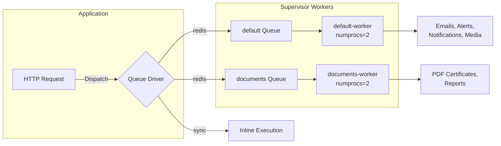

# Queue — Queue Configuration & Job Processing

> **Last updated:** 2026-06-13
> **Changes:** sync — initial metadata sync with new format
## Description

Queue driver configuration, job classes, failure handling, and worker management across different environments.

## Purpose

The queue layer enables asynchronous job processing. In Tier 1 (shared hosting), all jobs run **synchronously** via `QUEUE_CONNECTION=sync` — no worker process needed. In Tier 2+, Supervisor manages dual pipeline workers to move heavy operations off the HTTP request cycle.

---

## Driver Strategy by Tier

| Aspect          | Tier 1 (Shared Hosting — up to 500 registered users) | Tier 2+ (Standard / HA)      |
| --------------- | ---------------------------------------------------- | ---------------------------- |
| **Driver**      | `sync`                                               | `redis`                      |
| **Worker**      | None (inline)                                        | Supervisor-managed           |
| **Pipelines**   | N/A                                                  | `default` + `documents`      |
| **Retries**     | N/A (inline)                                         | 3 attempts with backoff      |
| **Failed jobs** | N/A                                                  | `failed_jobs` table          |
| **Throughput**  | N/A                                                  | ~1,000+ jobs/min             |

```env
# Tier 1 (default) — no worker needed
QUEUE_CONNECTION=sync

# Tier 2+
QUEUE_CONNECTION=redis
REDIS_HOST=127.0.0.1
REDIS_PORT=6379
```

---

## Dual Pipeline Architecture

Two separate queue pipelines prevent document compilation from blocking notification delivery:



### Pipeline Responsibilities

| Queue        | Jobs Processed                                  | Priority |
| ------------ | ----------------------------------------------- | -------- |
| `default`    | Email delivery, in-app notifications, alerts    | High     |
| `default`    | Media conversions (image thumbnails, WebP)      | Medium   |
| `documents`  | Certificate PDF generation                      | Low      |
| `documents`  | Report compilation (final grade cards, etc.)    | Low      |

### Supervisor Configuration (Tier 2+)

`/etc/supervisor/conf.d/internara-worker.conf`:

```ini
[program:internara-default-worker]
process_name=%(program_name)s_%(process_num)02d
command=php /path/to/app/artisan queue:work --queue=default --sleep=3 --tries=3 --max-time=3600
autostart=true
autorestart=true
stopasgroup=true
killasgroup=true
user=www-data
numprocs=2
redirect_stderr=true
stdout_logfile=/path/to/app/storage/logs/default-worker.log
stopwaitsecs=3600

[program:internara-documents-worker]
process_name=%(program_name)s_%(process_num)02d
command=php /path/to/app/artisan queue:work --queue=documents --sleep=3 --tries=3 --max-time=3600
autostart=true
autorestart=true
stopasgroup=true
killasgroup=true
user=www-data
numprocs=2
redirect_stderr=true
stdout_logfile=/path/to/app/storage/logs/documents-worker.log
stopwaitsecs=3600
```

```bash
# Start workers manually (development only)
php artisan queue:work --queue=default --sleep=3 --tries=3
php artisan queue:work --queue=documents --sleep=3 --tries=3

# Check worker status
php artisan queue:monitor default:default,documents:documents --max=100
```

---

## Job Design

Jobs are written the same way regardless of driver — the same code works in sync mode today and async mode tomorrow:

```php
class ProcessMediaConversion implements ShouldQueue
{
    use Queueable;

    public $tries = 3;
    public $backoff = [2, 10, 30];

    // Accept IDs, not whole models — the entity may change before the job runs
    public function __construct(public string $mediaId) {}

    public function handle(): void
    {
        // Process media conversion
    }

    public function failed(\Throwable $e): void
    {
        SmartLogger::error('media_conversion_failed')
            ->withPayload(['media_id' => $this->mediaId])
            ->systemOnly()
            ->save();
    }
}
```

### Guidelines

| Rule                                   | Rationale                                           |
| -------------------------------------- | --------------------------------------------------- |
| Accept IDs, not models                 | The model may change between dispatch and execution |
| Make jobs idempotent                   | Running twice should not duplicate results          |
| Handle missing entities gracefully     | Entity may have been deleted before job runs        |
| Set `$tries` and `$backoff`            | Prevent infinite retries on permanent failures      |
| Implement `failed()` for critical jobs | Surface permanent failures to operations            |

---

#Queue — Queue Configuration & Job Processinging in Sync Mode (Tier 1 — Shared Hosting)

With `QUEUE_CONNECTION=sync`, every job executes immediately during the HTTP request. This is the correct default for deployments with up to 500 registered users per PKL period.

| Operation                  | Behavior                          | User Experience                 |
| -------------------------- | --------------------------------- | ------------------------------- |
| Email delivery             | Sent during request (~1–3s)       | Slight delay on form submission |
| Media conversions          | Processed during upload (~0.5–2s) | Slight delay on file upload     |
| Certificate PDF generation | Generated during request (~2–5s)  | Slight delay on download        |
| Notification dispatch      | Stored immediately                | Instant (database write)        |

---

## Failed Jobs (Tier 2+)

When a worker is active, failed jobs are stored in the `failed_jobs` table for inspection:

```bash
php artisan queue:failed              # List failed jobs
php artisan queue:retry all           # Retry all failed
php artisan queue:prune-failed        # Prune old failed jobs (scheduled weekly)
```

Failed jobs older than 7 days are automatically pruned by the scheduler via `queue:prune-failed`.

---

## Where to Find It

- `config/queue.php` — queue connection configuration
- `config/database.php` — Redis connection settings
- `database/migrations/` — jobs and failed_jobs table migrations
- `app/Core/Contracts/SendsNotifications.php` — notification contract
- [Deployment](deployment.md) — Supervisor configuration (dual pipelines)
- [Infrastructure](infrastructure.md) — tier-based infrastructure design
- [Notification](notification.md) — notification channels and delivery
