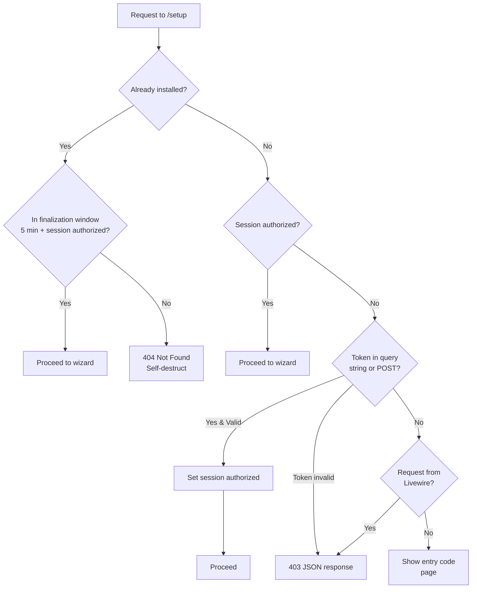

# Routes
> Last updated: 2026-06-06
> Changes: Updated middleware paths for Setup extraction, route file count to 17


## Philosophy

Routes are owned by modules, not by a single file. Each module registers its own routes in its own file under `routes/web/{module}.php`. The master `routes/web.php` simply stitches them together.

This exists because a single `routes/web.php` with 200+ lines creates merge conflicts and obscures which module owns which route. Splitting by module means you find a registration route in `registration.php`, not by grepping a thousand-line file.

## Architecture

The master file `routes/web.php` `require`s 17 module route files (Core and Shared have no routes). Load order matters: if two files register the same route name, the later one wins.

Additional route files exist outside `web/`: `console.php` (Artisan commands) and `ai.php` (model/AI interactions). `channels.php` (broadcasting) is referenced in `bootstrap/app.php` but not yet implemented.

Route files contain:
- `declare(strict_types=1)`
- Class imports for the handlers used in that file
- Route definitions grouped by middleware (guest, auth, role-specific)
- Named routes using `->name()` with dot-separated naming

Two route types exist:

- **Livewire pages** (`Route::livewire()`) — full-page components that handle both GET and POST. Used for most interactive features.
- **Controller endpoints** (`Route::get()`) — traditional controller methods. Used for downloads, document rendering, file serving, and the logout action.

## Global Middleware Pipeline (Every Request)

The following middleware runs on every web request, in order:

1. `web` (Laravel core) — session, CSRF, encryption, cookies
2. `SecurityHeaders` — Content-Security-Policy, X-Frame-Options, Permissions-Policy
3. `LogContext` — request tracing (request ID, session ID)
4. **`RequireSetupAccessMiddleware`** (`app/Setup/Http/Middleware/RequireSetupAccessMiddleware.php`) — redirects unauthenticated visitors to `/setup` when the
   system has not been installed yet. Allows bypass for Livewire subrequests and the `/setup`
   route itself.
5. `SetLocaleMiddleware` (`app/Settings/Http/Middleware/SetLocaleMiddleware.php`) — language preference from session/database
6. Route handler — Livewire or Controller routes

Global middleware is registered in `bootstrap/app.php`:

```php
$middleware->web(append: [
    SecurityHeaders::class,
    LogContext::class,
    RequireSetupAccessMiddleware::class,
    SetLocaleMiddleware::class,
]);
```

## Route-Specific Middleware

These middleware are applied per-route or per-group:

| Alias | Class | Applied To | Purpose |
|---|---|---|---|
| `setup.protected` | `ProtectSetupRouteMiddleware` (`app/Setup/Http/Middleware/ProtectSetupRouteMiddleware.php`) | Routes in `routes/web/setup.php` | Token-gates the setup wizard, rate-limits access, self-destructs after installation |
| `guest` | Laravel core | Login, register, forgot-password | Blocks authenticated users |
| `auth` | Laravel core | Most application routes | Requires authenticated session |
| `auth.throttle` | `AuthThrottleMiddleware` | All auth routes (login, register, forgot/reset password, confirm password) | Global rate limit (30 requests/min/IP) across all auth endpoints |
| `role:{roles}` | `CheckRoleMiddleware` | Admin, teacher, supervisor routes | Aborts 403 if user lacks required role |

See [Setup Wizard → Middleware System](../setup-wizard.md#middleware-system) for the complete
documentation of both middleware classes.

The `setup.protected` middleware flow:



## Route Naming Convention

All routes use `<prefix>.<resource>.<action>` naming. Prefixes match URL structure:

- `admin.*` — administration (role: super_admin|admin)
- `student.*` — student portal
- `teacher.*`, `supervisor.*` — mentor role portals
- `password.*` — password management (shared across roles)
- `certificates.*` — certificate operations

## Livewire Auto-Discovery

Livewire components are NOT registered in route files. The `AppServiceProvider` scans `app/{Module}/Livewire/` at boot, automatically registering each component with alias `{kebab-module}.{kebab-class-name}`.

This means a new Livewire component works immediately without any registration step — just create the class and its Blade view. The route file only needs `Route::livewire('/path', Component::class)`.

## Adding a Route

1. Open `routes/web/{module}.php` for the relevant module
2. Add `Route::livewire()` or `Route::get()` inside the correct middleware group
3. Name it with `->name('{prefix}.{resource}.{action}')`
4. Add sidebar menu entry in `config/menu.php`

For a new module: create `routes/web/{module}.php`, add `require` in `routes/web.php`
at the correct position for load-order precedence.

## Route Caching (Tier 2+)

```bash
php artisan route:cache
```

Before caching, ensure no route files contain Closure routes (replace with controller
classes). `Route::livewire()` is compatible with route caching. Clear and rebuild after
route changes:

```bash
php artisan route:clear
php artisan route:cache
```

## Infrastructure Context

| Tier | Route Handling | Caching |
|---|---|---|
| 1 (Shared) | Standard — no cache | ❌ Not needed |
| 2 (VPS) | Cached after deployment | ✅ `php artisan route:cache` |
| 3 (HA) | Cached per server | ✅ `route:cache` after each deploy |

## Where to Find It

- `routes/web.php` — master file with requires in dependency order
- `routes/web/` — 17 module route files (including `settings.php`)
- `routes/console.php` — Artisan command registrations
- `routes/channels.php` — broadcasting channel definitions (not implemented)
- `routes/ai.php` — AI integration routes
- `app/Core/Http/Middleware/` — global middleware classes
- `app/Auth/Permissions/Http/Middleware/` — role-check middleware (CheckRole)
- `app/Auth/Login/Http/Middleware/` — auth throttle middleware (AuthThrottle)
- `config/menu.php` — sidebar navigation mapping routes to menu items
- `docs/infrastructure/infrastructure.md` — tier-based infrastructure design
