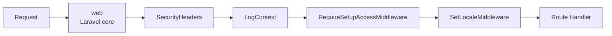

# Routes — Route Structure, Middleware & Naming

> **Last updated:** 2026-07-21 **Changes:** add submodule route file convention

## Description

Route structure, middleware stack, named route conventions, module split across 17 route files, and
URL design.

## Philosophy

Routes are owned by modules, not by a single file. Each module registers its own routes in its own
file under `routes/web/{module}.php`. The master `routes/web.php` simply stitches them together.

This approach avoids merge conflicts on a monolithic file and makes it obvious which module owns
which route. A registration route lives in `registration.php`, not in a thousand-line file.

### Submodule Route Files

Modules with multiple submodules may split routes into per-submodule files for better colocation.
When a submodule grows large enough to warrant its own route file, place it alongside the module
route file using the `{module}.{submodule}.php` naming convention:

```
routes/web/
├── settings.php              # Module-level routes (shared/general)
├── settings.branding.php     # Submodule: Branding
├── settings.locale.php       # Submodule: Locale
├── settings.theme.php        # Submodule: Theme
├── auth.php                  # Module-level routes
├── auth.login.php            # Submodule: Login
├── auth.password.php         # Submodule: Password
└── ...
```

The master `routes/web.php` `require`s submodule files after the parent module file. Both formats
are valid:

| Scenario | File | Example |
|----------|------|---------|
| Small module, all routes together | `{module}.php` | `auth.php` |
| Large module, submodule split | `{module}.{submodule}.php` | `auth.login.php` |
| Mixed (some shared, some split) | Both files | `settings.php` + `settings.locale.php` |

**Rule:** A module _may_ have submodule route files — this is _not_ required. Keep routes in the
parent module file unless the submodule has 5+ routes or belongs to a distinct business domain.

---

## Architecture

The master file `routes/web.php` `require`s 17 module route files in dependency order. Modules with
submodules may additionally `require` submodule-specific route files (e.g., `auth.login.php`). If
two files register the same route name, the later one wins.

```mermaid
flowchart LR
    subgraph routes/
        direction TB
        web_php[routes/web.php]
        web[web/]
        console[console.php]
        ai[ai.php]
        channels[channels.php<br/>(not implemented)]
    end

    web_php --> web

    subgraph routes/web/
        direction TB
        setup[setup.php]
        auth[auth.php]
        auth_login[auth.login.php<br/>submodule]
        user[user.php]
        sysadmin[sysadmin.php]
        document[document.php]
        academics[academics.php]
        partners[partners.php]
        program[program.php]
        enrollment[enrollment.php]
        assignment[assignment.php]
        assessment[assessment.php]
        evaluation[evaluation.php]
        guidance[guidance.php]
        journals[journals.php]
        incident[incident.php]
        certification[certification.php]
        reports[reports.php]
        settings[settings.php]
        settings_locale[settings.locale.php<br/>submodule]
    end

    web --> setup
    web --> auth
    web --> auth_login
    web --> user
    web --> sysadmin
    web --> document
    web --> academics
    web --> partners
    web --> program
    web --> enrollment
    web --> assignment
    web --> assessment
    web --> evaluation
    web --> guidance
    web --> journals
    web --> incident
    web --> certification
    web --> reports
    web --> settings
    web --> settings_locale
```

Route files contain:

- `declare(strict_types=1)`
- Class imports for the handlers used in that file
- Route definitions grouped by middleware (guest, auth, role-specific)
- Named routes using `->name()` with dot-separated naming

Two route types exist:

- **Livewire pages** (`Route::livewire()`) — full-page components that handle both GET and POST.
  Used for most interactive features.
- **Controller endpoints** (`Route::get()`) — traditional controller methods. Used for downloads,
  document rendering, file serving, and the logout action.

Additional route files outside `web/`:

| File           | Purpose                          | Status          |
| -------------- | -------------------------------- | --------------- |
| `console.php`  | Artisan command registrations    | Active          |
| `ai.php`       | AI integration routes            | Active          |
| `channels.php` | Broadcasting channel definitions | Not implemented |

---

## Global Middleware Pipeline (Every Request)

The following middleware runs on every web request, in order:



1. `web` (Laravel core) — session, CSRF, encryption, cookies
2. `SecurityHeaders` — Content-Security-Policy, X-Frame-Options, Permissions-Policy
3. `LogContext` — request tracing (request ID, session ID)
4. `RequireSetupAccessMiddleware` — redirects unauthenticated visitors to `/setup` when the system
   has not been installed yet. Allows bypass for Livewire subrequests and the `/setup` route itself.
5. `SetLocaleMiddleware` — language preference from session/database
6. Route handler — Livewire or Controller routes

Global middleware is registered in `bootstrap/app.php`:

```php
$middleware->web(
    append: [
        SecurityHeaders::class,
        LogContext::class,
        RequireSetupAccessMiddleware::class,
        SetLocaleMiddleware::class,
    ],
);
```

---

## Route-Specific Middleware

These middleware are applied per-route or per-group:

| Alias             | Class                         | Applied To                                                                 | Purpose                                                                             |
| ----------------- | ----------------------------- | -------------------------------------------------------------------------- | ----------------------------------------------------------------------------------- |
| `setup.protected` | `ProtectSetupRouteMiddleware` | Routes in `routes/web/setup.php`                                           | Token-gates the setup wizard, rate-limits access, self-destructs after installation |
| `guest`           | Laravel core                  | Login, register, forgot-password                                           | Blocks authenticated users                                                          |
| `auth`            | Laravel core                  | Most application routes                                                    | Requires authenticated session                                                      |
| `auth.throttle`   | `AuthThrottleMiddleware`      | All auth routes (login, register, forgot/reset password, confirm password) | Global rate limit (30 requests/min/IP) across all auth endpoints                    |
| `role:{roles}`    | `CheckRoleMiddleware`         | Admin, teacher, supervisor routes                                          | Aborts 403 if user lacks required role                                              |

---

## Route Naming Convention

All routes use `<prefix>.<resource>.<action>` naming. Prefixes match URL structure:

- `admin.*` — administration (role: super_admin|admin)
- `student.*` — student portal
- `teacher.*`, `supervisor.*` — mentor role portals
- `password.*` — password management (shared across roles)
- `certificates.*` — certificate operations

---

## Livewire Auto-Discovery

Livewire components are NOT registered in route files. The `AppServiceProvider` scans
`app/*/Livewire/` at boot, automatically registering each component with the alias
`{kebab-module}.{kebab-class-name}` (submodule components) or `{kebab-component-name}` (shared
components).

A new Livewire component works immediately without any registration step — just create the class and
its Blade view. The route file only needs `Route::livewire('/path', Component::class)`.

---

## Adding a Route

1. Open `routes/web/{module}.php` for the relevant module
2. Add `Route::livewire()` or `Route::get()` inside the correct middleware group
3. Name it with `->name('{prefix}.{resource}.{action}')`
4. Add sidebar menu entry in `config/menu.php`

For a submodule route: open `routes/web/{module}.{submodule}.php` (or create it if it does not
exist). Add the `require` in `routes/web.php` after the parent module file.

For a new module: create `routes/web/{module}.php`, add `require` in `routes/web.php` at the correct
position for load-order precedence.

---

## Route Caching (Tier 2+)

```bash
php artisan route:cache
```

Before caching, ensure no route files contain Closure routes (replace with controller classes).
`Route::livewire()` is compatible with route caching. Clear and rebuild after route changes:

```bash
php artisan route:clear
php artisan route:cache
```

### Infrastructure Context

| Tier       | Route Handling          | Caching                            |
| ---------- | ----------------------- | ---------------------------------- |
| 1 (Shared) | Standard — no cache     | ❌ Not needed                      |
| 2 (VPS)    | Cached after deployment | ✅ `php artisan route:cache`       |
| 3 (HA)     | Cached per server       | ✅ `route:cache` after each deploy |

---

## Where to Find It

- `routes/web.php` — master file with `require`s in dependency order
- `routes/web/` — 17 module route files (plus optional submodule files: `{module}.{submodule}.php`)
- `routes/console.php` — Artisan command registrations
- `routes/channels.php` — broadcasting channel definitions (not implemented)
- `routes/ai.php` — AI integration routes
- `bootstrap/app.php` — global middleware registration
- `app/Core/Http/Middleware/` — global middleware classes
- `app/Auth/Permissions/Http/Middleware/` — role-check middleware (CheckRole)
- `app/Auth/Login/Http/Middleware/` — auth throttle middleware (AuthThrottle)
- `app/Setup/Installation/Http/Middleware/` — setup middleware classes
- `config/menu.php` — sidebar navigation mapping routes to menu items
- [Infrastructure](infrastructure.md) — tier-based infrastructure design
