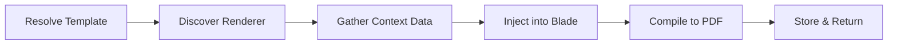

# Document — Templates, Handbooks & Rendering

> **Last updated:** 2026-07-10 **Changes:** expand — add Actions reference, routes, file structure, rendering pipeline detail, and integration patterns

## Description

Official correspondence template management, PDF letter rendering, policy handbook storage, and
compliance acknowledgement tracking.

## Purpose & Boundary

Document manages the school's official document repository — correspondence templates (permits,
parent consent letters) rendered via Blade + DomPDF. Handbooks are managed by the Guidance/Handbook
module and share the same unified `documents` table distinguished by `type = 'handbook'`. All
acknowledgements are recorded in the `activity_log` table for compliance audit.

Out of scope: certificate generation (Certification), final grade card (Reports), daily logbook
entries (Journals).

## Submodules

### OfficialDocument

Correspondence template management: create, edit, and render templates using Blade syntax with
DomPDF compilation. Supports variable substitution for student name, program details, dates, and
school information. Generated PDFs can be downloaded individually. Templates are versioned — updates
create new versions while preserving old ones for historical accuracy.

### Handbook (Moved to Guidance/Handbook)

Handbooks are now managed by the **Guidance/Handbook** module (`app/Guidance/Handbook/`). They use
the same `documents` table with `type = 'handbook'` and the same `activity_log` for acknowledgment
tracking. See [Guidance module](guidance.md) for the full Handbook reference.

## Key Concepts

### Unified Document Table

Templates and handbooks share a single `documents` table distinguished by a `type` discriminator
(`template`, `handbook`, `policy`, `guideline`). This prevents table sprawl while enabling document
type-specific behavior (rendering for templates, acknowledgement for handbooks). Each document
stores metadata as JSON.

### PDF Rendering Pipeline

Templates are rendered using Laravel Blade with DomPDF (`DocumentRenderer`). The pipeline follows 6 stages:



Variables resolve from the registration context (student name, program, dates) and system settings (school name, principal name). Rendering failures throw a `RenderException` logged via SmartLogger. Each rendered document records the exact template version used for historical accuracy.

### Policy Acknowledgement Tracking

Compliance-driven mandatory read-and-sign workflow for school policies. Key rules:

- Each policy version can be acknowledged once per user.
- Handbook updates increment the version, requiring a new acknowledgement.
- Acknowledgements are recorded in `activity_log` (append-only, immutable), not a separate table.
- IP address and user agent are captured for compliance audit.
- The acknowledgement log is queryable by policy type, version, and date range for reporting.

### Actions

| Action                                | Type      | Description                                         |
| ------------------------------------- | --------- | --------------------------------------------------- |
| `RenderDocumentAction`                | Command   | Render a template with context and return PDF path  |
| `AcknowledgeHandbookAction`           | Command   | Record handbook acknowledgement for current version |
| `CreateDocumentTemplateAction`        | Command   | Create a new document template                      |
| `UpdateDocumentTemplateAction`        | Command   | Update template content (creates new version)       |
| `ReadDocumentListAction`              | Read      | List documents with type/status filters             |

### Routes

| Method | URI                           | Action                            |
| ------ | ----------------------------- | --------------------------------- |
| GET    | `/documents/templates`        | Template index                    |
| POST   | `/documents/templates`        | Create template                   |
| GET    | `/documents/templates/{id}`   | Show template                     |
| PUT    | `/documents/templates/{id}`   | Update template                   |
| GET    | `/documents/templates/{id}/render/{registration}` | Render PDF        |
| POST   | `/documents/handbooks/{id}/acknowledge`           | Acknowledge handbook |

### Integration Patterns

- **Version Control**: Template updates create new versions; previous versions remain accessible for historical rendering
- **Rendering Queue**: PDF generation for batch operations is dispatched to the `documents` queue pipeline (Tier 2+)
- **Compliance Reports**: Acknowledgement data feeds into SysAdmin compliance dashboards
- **Cache Invalidation**: Template updates invalidate the template cache key `document.templates`

## Dependencies

- Core (base classes, SmartLogger)
- Settings (school metadata for variable substitution)
- Enrollment (student context for personalized documents)
- Program (required document template references)

## Used By

- Program (required document template references)
- Enrollment (document upload verification references)
- SysAdmin (compliance reporting)

## File Structure

```
app/Document/
├── Actions/
│   ├── AcknowledgeHandbookAction.php
│   ├── CreateDocumentTemplateAction.php
│   ├── ReadDocumentListAction.php
│   ├── RenderDocumentAction.php
│   └── UpdateDocumentTemplateAction.php
├── Enums/
│   └── DocumentType.php
├── Livewire/
│   ├── DocumentManager.php
│   └── HandbookViewer.php
├── Models/
│   └── Document.php
├── Policies/
│   └── DocumentPolicy.php
└── Services/
    └── DocumentRenderer.php
