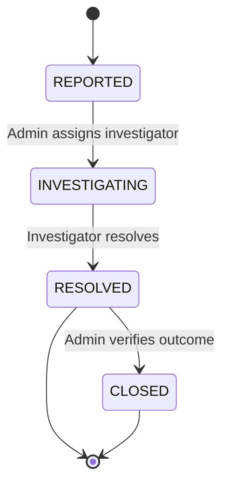

# Incident — Issue Reporting & Resolution

> **Last updated:** 2026-07-11 **Changes:** sync — remove implementation details (Actions, Routes, File Structure) to reference doc

## Description

Structured incident reporting, severity classification, investigation workflow, resolution tracking,
and escalation management.

## Purpose & Boundary

Incident provides a formal channel for reporting workplace issues during internships. Any
authenticated user — student, teacher, supervisor, or admin — can submit an incident report.
Incidents are classified by severity (LOW to CRITICAL), which determines routing and notification
behavior. Reports progress through an investigation workflow (REPORTED → INVESTIGATING → RESOLVED →
CLOSED) with an immutable timeline. Evidence files can be attached via Spatie Media Library.

Out of scope: daily complaints in logbooks (Journals), disciplinary actions (SysAdmin), general
support tickets.

## Submodules

### IncidentReport

Core entity: date/time, location, description, category, severity, current status, resolution outcome, and evidence file attachments. Immutable after creation — reports cannot be deleted, only status-transitioned. Linked to the reporter (always recorded — no anonymous reports), optional affected student, and optional program.

## Key Concepts

### Severity Classification

Four severity levels determine routing and urgency:

| Severity  | Description                                      | Routing                        | Notification                    |
| --------- | ------------------------------------------------ | ------------------------------ | ------------------------------- |
| **LOW**   | Minor concern, no immediate impact               | Assigned mentor                | In-app only                     |
| **MEDIUM** | Notable issue requiring attention               | Assigned supervisor            | In-app + email                  |
| **HIGH**  | Serious problem affecting operations             | All admins                     | Out-of-band + in-app            |
| **CRITICAL** | Immediate danger or active threat             | All superadmin + admin users   | Urgent email + in-app           |

Severity is set by the reporter. Admins can escalate severity during investigation. CRITICAL incidents also trigger an entry in the Pulse monitoring dashboard for real-time visibility.

### Investigation Workflow

Each transition requires an authorized actor and cannot skip steps. Transitions are recorded in an immutable timeline with timestamp, actor, action type, and notes.

### Resolution Outcomes

| Outcome                  | Meaning                                            |
| ------------------------ | -------------------------------------------------- |
| `CONFIRMED_ACTION_TAKEN` | Issue confirmed and corrective action applied      |
| `CONFIRMED_NO_ACTION`    | Issue confirmed but no corrective action needed    |
| `UNFOUNDED`              | Report could not be substantiated                  |
| `REFERRED`               | Issue referred to external authority (e.g., police) |

### Integration Patterns

- **Notifications**: CRITICAL severity dispatches `IncidentEscalatedNotification` to all admin users via email + in-app
- **Audit Trail**: Every state change is logged via SmartLogger with the activity key `incident.status_changed`
- **Pulse Monitoring**: CRITICAL incidents increment a Pulse counter for real-time ops awareness
- **Evaluation Impact**: Incident density per program feeds into program quality evaluation in the Evaluation module

## Dependencies

- Core (base classes, SmartLogger)
- Program (program context)
- Enrollment (optional student context)
- User (reporter identity)

## Used By

- SysAdmin (escalation handling, pulse monitoring)
- Evaluation (incident data may influence program quality evaluation)

