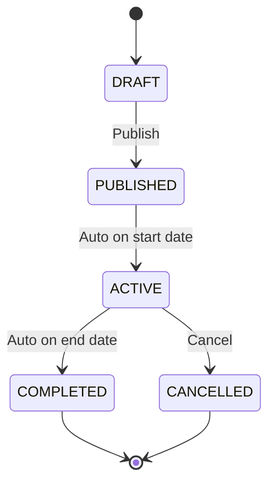

# Program — Internship Lifecycle, Groups & Phases

> **Last updated:** 2026-07-10 **Changes:** expand — add Actions reference, routes, status state machine, file structure, and integration patterns

## Description

Internship program definition, timeline phases, grading weight configuration, cohort group
management, and closure readiness checking.

## Purpose & Boundary

Program defines the structure and lifecycle of internship programs. Each program specifies duration,
dates, grading weights, sequential phases (stored as JSON), required document templates, and
capacity limits. Cohort groups organize students placed at the same company slot with assigned
supervisors. The module also provides closure readiness checks to prevent premature program
archiving.

Out of scope: student enrollment (Enrollment), daily activity tracking (Journals), grade compilation
(Reports).

## Submodules

### Internship

Core program entity with status lifecycle (`draft` → `active` → `closed`). Houses grading weight
configuration (supervisor, teacher, exam percentages), phases JSON array (chronologically ordered,
non-overlapping), required document template checklist, date bounds constrained by the active
academic year, and capacity limits.

### InternshipGroup

Cohort management for students placed at the same company slot. Each group has an assigned school
teacher and industry supervisor. Members are tracked via `InternshipGroupMember` with role
classification (`school_teacher`, `industry_supervisor`, `student`). Group capacity is constrained
by the company slot quota.

Internship phases are defined globally via the `internship_phases` setting (key-value store). Each
phase has a `weight` (percentage of total program duration). The current phase for a registration is
computed automatically by comparing today's date against the program's date range. Programs can
optionally override phases via the `internships.phases` JSON column.

## Key Concepts

### JSON-Inlined Configuration

Instead of separate tables for phases and document requirements, these are stored as structured JSON
columns on the `internships` table. This prevents table sprawl while keeping configuration cohesive.
Phases must be chronologically ordered and contiguous (no gaps or overlaps).

### Grading Weights

Each internship program defines the weight distribution between evaluation sources: industry
supervisor score, school teacher score, and exam/presentation score. These weights are consumed by
the Reports module when calculating final grade cards.

### Program State Machine



DRAFT → PUBLISHED requires at least one placement slot configured. ACTIVE → CANCELLED requires a reason for audit trail.

### Closure Readiness

Before a program can transition to `closed`, the system validates:

| Check                              | Description                                    |
| ---------------------------------- | ---------------------------------------------- |
| Grade Cards Finalized              | All enrolled students have finalized reports   |
| Evaluations Collected              | Required evaluations completed for all targets |
| No Pending HIGH/CRITICAL Incidents | All severe incidents resolved or closed        |
| Logbook Compliance                 | Minimum logbook entry frequency met            |

The readiness check returns a detailed report of blocking items with actionable remediation steps.

### Grading Weights

Each program defines weight distribution between evaluation sources:

```
supervisor_score: 40%
teacher_score:    40%
exam_score:       20%
```

These weights are consumed by the Reports module when calculating final grade cards. Weights must sum to 100%.

### Actions

| Action                                        | Type      | Description                                       |
| --------------------------------------------- | --------- | ------------------------------------------------- |
| `CreateInternshipAction`                      | Command   | Create a new program with dates, weights, phases  |
| `UpdateInternshipAction`                      | Command   | Update program configuration                      |
| `PublishInternshipAction`                     | Command   | Transition DRAFT → PUBLISHED                      |
| `CancelInternshipAction`                      | Command   | Transition ACTIVE → CANCELLED with reason         |
| `CheckClosureReadinessAction`                 | Read      | Validate all closure prerequisites                |
| `CreateInternshipGroupAction`                 | Command   | Create student cohort group                       |
| `ReadInternshipListAction`                    | Read      | Query programs with filters and status            |

### Routes

| Method | URI                                              | Action                       |
| ------ | ------------------------------------------------ | ---------------------------- |
| GET    | `/program/internships`                           | Program index                |
| POST   | `/program/internships`                           | Create program               |
| GET    | `/program/internships/{internship}`              | Show program                 |
| PUT    | `/program/internships/{internship}`              | Update program               |
| POST   | `/program/internships/{internship}/publish`      | Publish program              |
| POST   | `/program/internships/{internship}/cancel`       | Cancel program               |
| GET    | `/program/internships/{internship}/closure-check`| Closure readiness report     |
| GET    | `/program/groups`                                | Group index                  |
| POST   | `/program/groups`                                | Create group                 |

### Integration Patterns

- **Assessment**: Program grading weights consumed by Assessment scoring calculations
- **Reports**: Final grade calculation uses program-defined weight distribution
- **Enrollment**: Registration is scoped to program; placement capacity constrained by program dates
- **Journals**: Activity tracking and attendance scoped to active program period
- **Cache**: Program configuration cached with key `program.{id}`; invalidated on program update

## Dependencies

- Core (base classes, SmartLogger)
- Academics (academic year for date scoping)
- Partners (company slots for placement)

## Used By

- Enrollment (registration scope)
- Journals (activity context)
- Assessment (grading context)
- Reports (grade compilation)
- Guidance (supervision scope)

## File Structure

```
app/Program/
├── Actions/
│   ├── CancelInternshipAction.php
│   ├── CheckClosureReadinessAction.php
│   ├── CreateInternshipAction.php
│   ├── CreateInternshipGroupAction.php
│   ├── PublishInternshipAction.php
│   ├── ReadInternshipListAction.php
│   └── UpdateInternshipAction.php
├── Enums/
│   └── InternshipStatus.php
├── Events/
│   ├── InternshipPublished.php
│   └── InternshipCancelled.php
├── Livewire/
│   ├── InternshipManager.php
│   ├── InternshipEditor.php
│   └── InternshipGroupManager.php
├── Models/
│   ├── Internship.php
│   ├── InternshipGroup.php
│   └── InternshipGroupMember.php
└── Policies/
    └── InternshipPolicy.php
