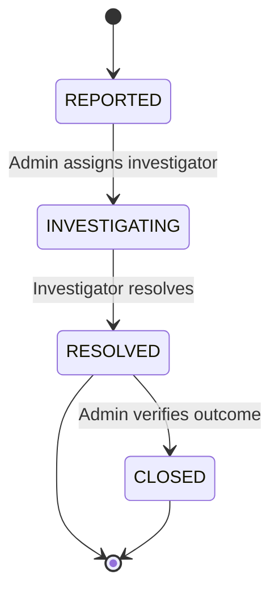

# Incident — Issue Reporting & Resolution

## Description

Structured incident reporting, severity classification, investigation workflow, resolution tracking,
and escalation management.

## Purpose & Boundary

Incident provides a formal channel for reporting workplace issues during internships. Any
authenticated user — student, teacher, supervisor, or admin — can submit an incident report.
Incidents are classified by severity (LOW to CRITICAL), which determines routing and notification
behavior. Reports progress through an investigation workflow (REPORTED → INVESTIGATING → RESOLVED →
CLOSED) with an immutable timeline. Evidence files can be attached via Spatie Media Library.

Out of scope: daily complaints in logbooks (Journals), disciplinary actions (SysAdmin), general
support tickets.

## Submodules

### IncidentReport

Core entity: date/time, location, description, category, severity, current status, resolution outcome, and evidence file attachments. Immutable after creation — reports cannot be deleted, only status-transitioned. Linked to the reporter (always recorded — no anonymous reports), optional affected student, and optional program.

## Key Concepts

### Severity Classification

Four severity levels determine routing and urgency:

| Severity  | Description                                      | Routing                        | Notification                    |
| --------- | ------------------------------------------------ | ------------------------------ | ------------------------------- |
| **LOW**   | Minor concern, no immediate impact               | Assigned mentor                | In-app only                     |
| **MEDIUM** | Notable issue requiring attention               | Assigned supervisor            | In-app + email                  |
| **HIGH**  | Serious problem affecting operations             | All admins                     | Out-of-band + in-app            |
| **CRITICAL** | Immediate danger or active threat             | All superadmin + admin users   | Urgent email + in-app           |

Severity is set by the reporter. Admins can escalate severity during investigation. CRITICAL incidents also trigger an entry in the Pulse monitoring dashboard for real-time visibility.

### Investigation Workflow

Each transition requires an authorized actor and cannot skip steps. Transitions are recorded in an immutable timeline with timestamp, actor, action type, and notes.

### Resolution Outcomes

| Outcome                  | Meaning                                            |
| ------------------------ | -------------------------------------------------- |
| `CONFIRMED_ACTION_TAKEN` | Issue confirmed and corrective action applied      |
| `CONFIRMED_NO_ACTION`    | Issue confirmed but no corrective action needed    |
| `UNFOUNDED`              | Report could not be substantiated                  |
| `REFERRED`               | Issue referred to external authority (e.g., police) |

### Integration Patterns

- **Notifications**: All incidents notify admins and supervising teachers via `IncidentReportedNotification` (email + in-app)
- **Audit Trail**: Every state change is logged via SmartLogger with the activity key `incident.status_changed`
- **Pulse Monitoring**: CRITICAL incidents increment a Pulse counter for real-time ops awareness
- **Evaluation Impact**: Incident density per program feeds into program quality evaluation in the Evaluation module

## Dependencies

- Core (base classes, SmartLogger)
- Program (program context)
- Enrollment (optional student context)
- User (reporter identity)

## Used By

- SysAdmin (escalation handling, pulse monitoring)
- Evaluation (incident data may influence program quality evaluation)

## Design Principles

- **Severity determines routing and urgency, not the reporter** — severity levels (LOW → CRITICAL) are the primary routing signal. CRITICAL incidents reach all superadmin and admin users immediately via out-of-band channels and Pulse. Severity is set by the reporter; admins can escalate it during investigation but never downgrade a severity classification.
- **Incident reports are immutable after creation** — reports cannot be deleted, only status-transitioned. All mutations are recorded in an immutable timeline (timestamp, actor, action type, notes). No anonymous reports — the reporter identity is always recorded.
- **Investigation workflow is sequential, not skippable** — the workflow `REPORTED → INVESTIGATING → RESOLVED → CLOSED` enforces a fixed sequence. Each transition requires an authorized actor; no step can be skipped. A CRITICAL incident that is never investigated cannot be closed.
- **Resolution outcomes are enumerated and meaningful** — the four outcomes (`CONFIRMED_ACTION_TAKEN`, `CONFIRMED_NO_ACTION`, `UNFOUNDED`, `REFERRED`) are intentionally limited so that the resolution record is programmatically meaningful, not free text. An UNFOUNDED report is different from one where no action was needed — this distinction matters for program quality scoring.

## How It Works

Incident reporting exists for the cases the happy path cannot describe: injury, harassment,
equipment failure, a dispute with a host employer. The record captures when and where it happened,
what happened, how serious it is, and what was done about it — plus any evidence files.

Severity is not decoration: it decides who is notified and how. A low-severity concern goes to the
mentor in-app, while anything more serious escalates to the supervisor and adds email, so that
urgency is carried by the system's behaviour rather than by whoever reads the list.

The record is append-only. Reports are never deleted, only transitioned through their status
lifecycle as they are investigated and resolved, and the reporter is always identified — there is
no anonymous submission, because an untraceable incident report is not usable in a dispute or an
accreditation review. Soft deletion on the company and student records the report points at
preserves that history even when the underlying person or organization is later removed.

