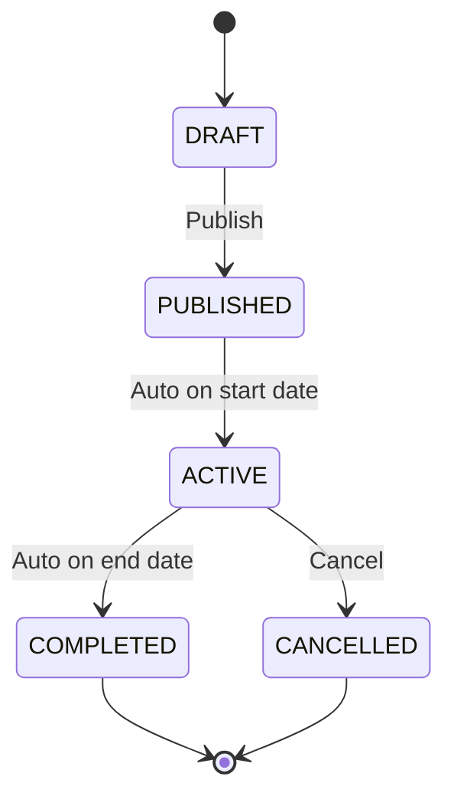

# Program — Internship Lifecycle, Groups & Phases

## Description

Internship program definition, timeline phases, grading weight configuration, cohort group
management, and closure readiness checking.

## Purpose & Boundary

Program defines the structure and lifecycle of internship programs. Each program specifies duration,
dates, grading weights, sequential phases (stored as JSON), required document templates, and
capacity limits. Cohort groups organize students placed at the same company slot with assigned
supervisors. The module also provides closure readiness checks to prevent premature program
archiving.

Out of scope: student enrollment (Enrollment), daily activity tracking (Journals), grade compilation
(Reports).

## Submodules

### Internship

Core program entity with status lifecycle (`draft` → `published` → `active` → `completed` → `archived`, with
`cancelled` reachable from any pre-completion state). Houses grading weight
configuration (supervisor, teacher, exam percentages), phases JSON array (chronologically ordered,
non-overlapping), required document template checklist, date bounds constrained by the active
academic year, and capacity limits.

### InternshipGroup

Cohort management for students placed at the same company slot. Each group has an assigned school
teacher and industry supervisor. Members are tracked via `InternshipGroupMember` with role
classification (`school_teacher`, `industry_supervisor`, `student`). Group capacity is constrained
by the company slot quota.

Internship phases are defined globally via the `internship_phases` setting (key-value store). Each
phase has a `weight` (percentage of total program duration). The current phase for a registration is
computed automatically by comparing today's date against the program's date range. Programs can
optionally override phases via the `internships.phases` JSON column.

## Key Concepts

### JSON-Inlined Configuration

Instead of separate tables for phases and document requirements, these are stored as structured JSON
columns on the `internships` table. This prevents table sprawl while keeping configuration cohesive.
Phases must be chronologically ordered and contiguous (no gaps or overlaps).

### Grading Weights

Each internship program defines the weight distribution between evaluation sources: industry
supervisor score, school teacher score, and exam/presentation score. These weights are consumed by
the Reports module when calculating final grade cards.

### Program State Machine

DRAFT → PUBLISHED requires at least one placement slot configured. ACTIVE → CANCELLED requires a reason for audit trail.

### Closure Readiness

Before a program can transition to `closed`, the system validates:

| Check                              | Description                                    |
| ---------------------------------- | ---------------------------------------------- |
| Grade Cards Finalized              | All enrolled students have finalized reports   |
| Evaluations Collected              | Required evaluations completed for all targets |
| No Pending HIGH/CRITICAL Incidents | All severe incidents resolved or closed        |
| Logbook Compliance                 | Minimum logbook entry frequency met            |

The readiness check returns a detailed report of blocking items with actionable remediation steps.

### Integration Patterns

- **Assessment**: Program grading weights consumed by Assessment scoring calculations
- **Reports**: Final grade calculation uses program-defined weight distribution
- **Enrollment**: Registration is scoped to program; placement capacity constrained by program dates
- **Journals**: Activity tracking and attendance scoped to active program period
- **Cache**: Program configuration cached with key `program.{id}`; invalidated on program update

## Dependencies

- Core (base classes, SmartLogger)
- Academics (academic year for date scoping)
- Partners (company slots for placement)

## Used By

- Enrollment (registration scope)
- Journals (activity context)
- Assessment (grading context)
- Reports (grade compilation)

## Design Principles

- **JSON-inlined phases are self-contained and order-enforced** — phases (duration, weights) live as a JSON column on `internships`, not in a separate table. The application layer enforces chronological ordering and contiguity (no gaps, no overlaps) at write time. A gap between phases is a validation error, not a UI rendering quirk.
- **Closure readiness is a gate, not a suggestion** — before a program transitions to `closed`, all checks (grade cards finalized, evaluations collected, no pending HIGH/CRITICAL incidents, logbook compliance met) must pass. The readiness report enumerates blocking items with remediation steps; no silent override is possible.
- **Grading weight distribution is program-owned, report-consumed** — each internship program defines the split between supervisor, teacher, and exam. Reports reads these weights to calculate composite scores. Weight changes after assessments are finalized do not retroactively alter grade cards.
- **Program dates bound all student activity** — logbook entries, attendance, and assessment submissions outside the active program period are rejected. The program date range is the session window; nothing meaningful happens outside it.

## How It Works

A program is the agreement between a school and a cohort: which competencies are assessed, what
share each evaluator carries, when each phase runs, which documents must be on file, and how many
students it can take. Because those weights are configuration rather than code, the same platform
can run a program graded mostly by the industry supervisor and another graded mostly by exam,
without either being a special case in the code.

A program's status is the real state machine of the module, and each state means something
different. A draft is still being negotiated and is not visible to students. Publishing makes the
program offerable and opens registration. Active is the period in which placement, journaling, and
assessment happen. Completing stops the numbers moving so reports become final, and archiving
preserves the finished cohort read-only. Cancellation is the escape hatch available at any point
before completion — the realistic case being a company partnership collapsing mid-program.

Because completion is what makes results final, the close path checks readiness across five areas
before it will proceed — finalized assessments, graded submissions, complete supervision logs,
attendance, and issued certificates — reporting totals and what is still pending for each. A
coordinator therefore sees exactly which students are blocking the close, rather than discovering
it after the fact.

Groups are how the cohort is actually staffed. A group gathers the students sharing one company
slot together with the two people responsible for them — an industry supervisor and a school
teacher — so supervision has an explicit owner at all times. Group size is bounded by the slot
quota, which means the roster can never promise more placements than the company agreed to host.
- Journals (monitoring visits scope)

