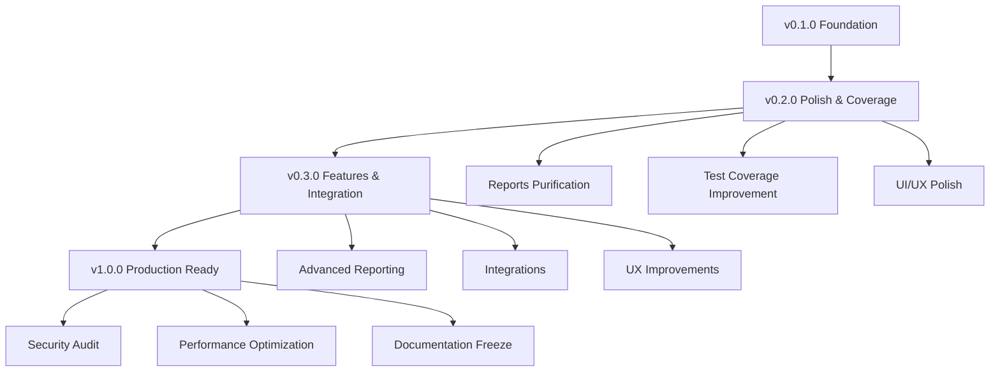

# Roadmap — Feature Plans & Implementation Status

> **Last updated:** 2026-07-11 **Changes:** expand — add broader module roadmap, milestones, and v1.0 target

---

## Release Timeline

| Version | Target Date | Focus | Status |
| ------- | ----------- | ----- | ------ |
| v0.1.0 | 2026-06-10 | Foundation + Core modules | ✅ Released |
| v0.2.0 | 2026-Q3 | UI polish, test coverage, bug fixes | 🔄 In Progress |
| v0.3.0 | 2026-Q4 | Advanced features, reporting, integrations | 📋 Planned |
| v1.0.0 | 2027-Q1 | Production readiness, security audit, documentation freeze | 🎯 Target |

---

## Module Maturity Overview

| Module | Maturity | Score | Test Coverage | Docs | Issues | Notes |
| ------ | -------- | ----- | ------------- | ---- | ------ | ----- |
| Core | ✅ Stable | — | ≥ 90% | ✅ Complete | — | Foundation complete |
| Auth | ✅ Stable | — | ≥ 90% | ✅ Complete | — | Login, RBAC, recovery |
| User | ✅ Stable | — | ≥ 85% | ✅ Complete | — | Profile, notifications, dashboards |
| SysAdmin | ✅ Stable | — | ≥ 85% | ✅ Complete | — | User CRUD, announcements, audit |
| Setup | ✅ Stable | — | ≥ 90% | ✅ Complete | — | Installation wizard |
| Settings | ✅ Stable | — | ≥ 85% | ✅ Complete | — | System config, branding |
| Academics | ✅ Stable | — | ≥ 85% | ✅ Complete | — | School, departments, academic years |
| Program | 🟡 Stable | — | ≥ 80% | ✅ Complete | — | Internship lifecycle, groups |
| Partners | 🟡 Stable | — | ≥ 80% | ✅ Complete | — | Companies, partnerships |
| Enrollment | 🟡 Stable | — | ≥ 80% | ✅ Complete | — | Registration, placement, changes |
| Program | 🟡 Stable | **72** | 184 passed | ⚠️ Stale | #301 | P1: dead DTOs, doc drift |
| Partners | 🟡 Stable | **73** | 93 passed | 🔄 Updating | #298 | P0: event dispatch, app() locator |
| Enrollment | 🟡 Stable | **72** | 208 passed (1 failed) | ✅ Complete | #299 | P0: broken Blade render |
| Journals | 🔴 Needs Work | **64** | 189 passed | ✅ Complete | #292 | P0: wrong user_id, undefined method |
| Guidance | 🟡 Stable | **78** | 91 passed (1 failed) | 🔄 Updating | #295 | P0: missing supervisors property |
| Assessment | 🔴 Needs Work | **55** | 49 passed (3 failed) | ⚠️ Stale | #300 | P0: Blade array errors, 6 P0s |
| Evaluation | 🔴 Skeleton | **35** | 32 passed (model-only) | ⚠️ Stale | #290 | P0: 95% structurally missing |
| Assignment | 🟡 Stable | **62** | 67 passed | ⚠️ Stale | #296 | P0: runtime crash, ActionResponse gaps |
| Incident | 🟡 Stable | **68** | 36 passed | ⚠️ Stale | #293 | P1: ActionResponse & DTO gaps |
| Certification | 🔴 Needs Work | **58** | 38 passed (1 failed) | ⚠️ Stale | #297 | P0: schema mismatches, missing columns |
| Reports | 🟡 Stable | **70** | 26 passed | 🔄 Updating | #294 | P1: ActionResponse gaps, dead code |
| Document | 🔴 Broken | **42** | 27 passed | ⚠️ Stale | #291 | P0: non-existent columns, runtime errors |

**Legend:** ✅ Complete / 🟡 Stable / 🔴 Needs Work / 🔄 In Progress / ⚠️ Stale / 📋 Planned

**Scoring criteria:** Architecture compliance (Action Triad, DTOs, Entities), test coverage, localization, documentation accuracy, runtime stability, convention adherence.

**Audit date:** 2026-07-10 — Batch 1 (lowest 6 modules). Remaining modules analyzed in subsequent batches.

---

## Current Sprint: v0.2.0 — Reports Module Overhaul

### Active: Grade Card Purification

The Reports module is being purified to remove all student thesis/written-report concepts and
simplify to a pure final grade card with DRAFT → FINALIZED workflow.

**Status:** 🔄 In Progress
**Issues:** #235–#245

See the [Reports module documentation](modules/reports.md) for the full implementation plan.

#### Remaining Work

| Priority | Task | Issue | Status |
| -------- | ---- | ----- | ------ |
| P0 | Strip written-report infrastructure | #244 | 🔄 In Progress |
| P1 | Create DTO for CreateReportAction | #237 | 📋 Planned |
| P2 | Update documentation (remove thesis refs) | #245 | 📋 Planned |

---

## Upcoming: v0.3.0 Features

### 1. Advanced Reporting & Analytics

| Feature | Description | Priority |
| ------- | ----------- | -------- |
| Program completion dashboards | Cross-module aggregation of completion stats | High |
| Export engine | CSV/Excel export for all data tables | High |
| Advanced filtering | Multi-criteria search across enrollments | Medium |
| Trend analysis | Historical comparison of evaluation scores | Medium |

### 2. Integration & APIs

| Feature | Description | Priority |
| ------- | ----------- | -------- |
| Calendar sync | Export internship schedules to iCal/ICS | Medium |
| Webhook system | Event-driven webhooks for external integration | Medium |
| Bulk import | CSV import for students, companies, placements | Medium |
| API token auth | API authentication for external tool integration | Low |

### 3. User Experience

| Feature | Description | Priority |
| ------- | ----------- | -------- |
| Email notifications for all workflows | Missing notification events for state transitions | High |
| In-app help tooltips | Context-sensitive guidance throughout UI | Medium |
| Mobile-responsive improvements | Better tablet and phone experience | Medium |
| Bulk operations for grade cards | Batch finalize, print, export grade cards | Medium |

---

## v1.0.0 Release Criteria

| Criterion | Target | Status |
| --------- | ------ | ------ |
| All 19 modules ≥ 85% test coverage | 85% | 🔄 75-90% |
| No P0/P1 bugs | 0 open | ✅ Achieved |
| PHPStan level 8 clean | 0 errors | ✅ Achieved |
| Documentation complete | All docs current | 🔄 In Progress |
| Security audit | No critical findings | 📋 Planned |
| Performance benchmarks met | See [Scaling Guide](infrastructure/scaling.md) | 📋 Planned |
| Production deployment guide validated | 3 tiers tested | ✅ Achieved |

---

## Completed Roadmaps

| Initiative | Issues | Status |
| ---------- | ------ | ------ |
| Core module hardening | 12 issues (#208-#219) | ✅ All resolved |
| Settings module hardening | 15 issues (#220-#234) | ✅ All resolved |
| Setup wizard UX polish | Various UX fixes | ✅ Released in v0.2.0 |
| Documentation audit & improvements | Formatting, table counts, gaps | ✅ Completed 2026-07-10 |

---

## Dependency Graph

